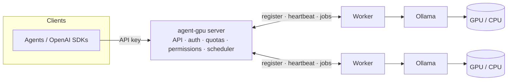

# agent-gpu

[](https://github.com/jaypetez/agent-gpu/actions/workflows/ci.yml)
[](https://scorecard.dev/viewer/?uri=github.com/jaypetez/agent-gpu)
[](LICENSE)

**agent-gpu** is a distributed inference layer for [Ollama](https://ollama.com). It forwards
agent requests to remote GPU-powered Ollama instances and exposes a clean, OpenAI-compatible
API for running open-source LLMs across your network.

A central **server** owns the public API, authentication, quotas, permissions, and scheduling.
One or more **workers** run Ollama locally and execute inference jobs dispatched by the server.

## Why

- **Pool your GPUs.** Run one API endpoint backed by many machines and accelerators.
- **Made for agents.** OpenAI-compatible `/v1/chat/completions` with streaming and function calling.
- **Multi-tenant by design.** API keys, role-based permissions, per-model allow/deny lists, and quotas.
- **Runs anywhere.** Standalone binaries for Windows/macOS/Linux (x64 + ARM64), or via Docker.

## Architecture



See [docs/architecture.md](docs/architecture.md) for the request-flow diagram and details.

## Install

Pre-built, statically-linked binaries are published for Windows, macOS, and Linux on both
x64 (`amd64`) and ARM64 from the
[Releases page](https://github.com/jaypetez/agent-gpu/releases).

1. Download the archive for your OS/arch (`agentgpu_<version>_<os>_<arch>.tar.gz`, or `.zip`
   on Windows).
2. Verify it against the published `checksums.txt`:

   ```bash
   # Linux / macOS
   sha256sum --check --ignore-missing checksums.txt
   ```

   ```powershell
   # Windows (PowerShell)
   (Get-FileHash .\agentgpu_<version>_windows_amd64.zip -Algorithm SHA256).Hash
   ```

3. Extract the archive and put the `agentgpu` binary on your `PATH`, then confirm it runs:

   ```bash
   agentgpu --version
   ```

Alternatively, install from source with the Go toolchain:

```bash
go install github.com/jaypetez/agent-gpu/cmd/agentgpu@latest
```

## Quickstart

```bash
# 1. Bootstrap the first admin key into the on-disk store BEFORE the server runs.
#    --local writes the key file directly; the server loads it at boot.
agentgpu key create --name bootstrap --role admin --local
#    -> prints a one-time token; save it.

# 2. Start the server (it reads the store written above).
agentgpu server start

# 3. Start a worker on a machine with Ollama installed (gRPC host:port).
agentgpu worker start --server SERVER_HOST:50051

# 4. Point the CLI at the running server and mint a user key over the admin API.
export AGENTGPU_HTTP_ADDR=http://SERVER_HOST:8080
export AGENTGPU_TOKEN=<the admin token from step 1>
agentgpu key create --name my-agent --role user      # -> prints the user token
agentgpu models list                                 # the permitted catalog

# 5. Make a request (OpenAI-compatible) with the user token.
curl http://SERVER_HOST:8080/v1/chat/completions \
  -H "Authorization: Bearer $AGENTGPU_USER_KEY" \
  -H "Content-Type: application/json" \
  -d '{"model":"llama3","messages":[{"role":"user","content":"Hello!"}]}'
```

After step 4 the CLI manages the **running** server over its HTTP admin API, so
`key revoke`, `quota set`, and permission changes take effect immediately (no
restart). See [CLI](#cli) for the full command reference.

### CLI

`agentgpu` is a single binary with subcommands. `server start` and `worker start`
run the long-lived processes; `key`, `quota`, and `models` are operator commands.

By default the operator commands act against a **running server** over its public
HTTP admin API, so changes are immediate. Configure the target with
flag > environment > default:

| Flag | Environment | Default | Purpose |
| --- | --- | --- | --- |
| `--server` / `--url` | `AGENTGPU_HTTP_ADDR` | `http://127.0.0.1:8080` | HTTP API base URL |
| `--token` | `AGENTGPU_TOKEN` | _(none)_ | admin Bearer token |
| `--store` | `AGENTGPU_STORE_PATH` | `~/.agentgpu/keys.json` | on-disk keys file (used with `--local`) |

```bash
# Keys (against a running server; needs an admin --token / $AGENTGPU_TOKEN)
agentgpu key create --name app --role user [--allow-model m] [--deny-model m]
agentgpu key list
agentgpu key revoke <id>          # invalidates the key immediately
agentgpu key rotate <id>          # new one-time token; old token stops working
agentgpu key perms <id> --role user --allow-model llama3

# Quotas (immediate, enforced updates)
agentgpu quota set <id> --rpm 60 --tpm 1000 [--daily-tokens N] [--monthly-tokens N]
agentgpu quota set <id> --clear   # revert to the global defaults
agentgpu quota show <id>          # usage vs limits

# Catalog
agentgpu models list              # operator table (NAME, DIGEST, WORKERS)
agentgpu models list --json       # raw /models JSON
agentgpu models list --openai     # OpenAI-canonical /v1/models JSON
```

**Offline bootstrap.** Before any server is running there is no admin token to
authenticate with, so mint the first admin key directly into the on-disk store
with `--local` (as in step 1 above). `--local` works without a server or token;
because the server only reads the store at boot, a `--local` change to an
already-running server takes effect after a restart. Use the HTTP mode (a
`--token`) to manage a live server. The `key` and `quota` commands accept
`--local`; `models list` is HTTP-only (the catalog only exists on a running
server).

The created/rotated **token is printed exactly once** and is never stored or
shown again; `key list` shows metadata only and never a secret.

Commands return distinct exit codes so scripts can branch: `0` success
(including `--help`), `1` general error, `2` usage error, `3` auth failure
(401/403), `4` not found (404), `5` could not reach the server. Run
`agentgpu <command> --help` for per-command flags.

### Run with Docker

The fastest way to a working stack is Docker Compose — server, a worker, a local
Ollama (with a tiny model pulled automatically), and the backing services, in one
command:

```bash
docker compose up -d --build
# Bootstrap a key, then call http://localhost:8080 — see docs/docker.md.
docker compose down -v   # clean teardown
```

Scale workers with `docker compose up -d --scale worker=3`. The full guide
(key bootstrap, sample inference request, persistence demo, GPU access) is in
[docs/docker.md](docs/docker.md).

Or run the two minimal, non-root images directly. They are built from one
multi-stage [`Dockerfile`](Dockerfile) and published to GHCR on each release:

```bash
# Server: the public API + control plane. /data holds key/quota/session state.
docker run -d -p 8080:8080 -p 50051:50051 -v agentgpu-data:/data \
  ghcr.io/jaypetez/agent-gpu/server:latest

# Worker: point it at the server (gRPC host:port) and an Ollama that owns the GPU.
docker run -d \
  -e AGENTGPU_SERVER_ADDR=server-host:50051 \
  -e AGENTGPU_OLLAMA_URL=http://host.docker.internal:11434 \
  ghcr.io/jaypetez/agent-gpu/worker:latest
```

To build locally instead, select a target: `docker build --target server -t
agentgpu-server .` (or `--target worker`). Two things to know in containers: the
server image already binds `0.0.0.0` (the binary defaults to loopback), and the
worker's `AGENTGPU_OLLAMA_URL` must **not** be `localhost` (that is the worker
container itself) — use the Ollama service name or `host.docker.internal`. See
[docs/docker.md](docs/docker.md) for the full guide.

## Documentation

- [Architecture](docs/architecture.md)
- [Running with Docker](docs/docker.md)
- [Releasing](docs/releasing.md)
- [Contributing](CONTRIBUTING.md) · [Support](SUPPORT.md) · [Changelog](CHANGELOG.md)
- Developer Guide — see [#26](https://github.com/jaypetez/agent-gpu/issues/26)
- API Reference — see [#27](https://github.com/jaypetez/agent-gpu/issues/27)

## Project status

Early development. Work is tracked as GitHub Issues grouped into milestones (epics) on the
[**agent-gpu roadmap**](https://github.com/users/jaypetez/projects/10) board. Contributions welcome —
see [CONTRIBUTING.md](CONTRIBUTING.md).

## License

See [LICENSE](LICENSE).
