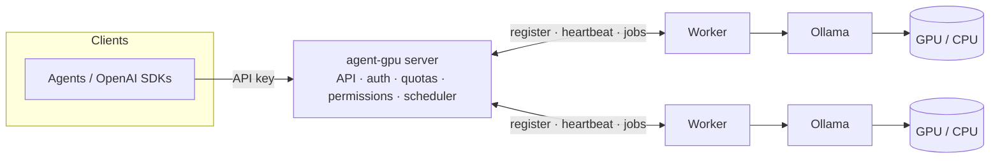

# agent-gpu

[](https://github.com/jaypetez/agent-gpu/actions/workflows/ci.yml)
[](https://scorecard.dev/viewer/?uri=github.com/jaypetez/agent-gpu)
[](LICENSE)

**agent-gpu** is a distributed inference layer for [Ollama](https://ollama.com). It forwards
agent requests to remote GPU-powered Ollama instances and exposes a clean, OpenAI-compatible
API for running open-source LLMs across your network.

A central **server** owns the public API, authentication, quotas, permissions, and scheduling.
One or more **workers** run Ollama locally and execute inference jobs dispatched by the server.

## Why

- **Pool your GPUs.** Run one API endpoint backed by many machines and accelerators.
- **Made for agents.** OpenAI-compatible `/v1/chat/completions` with streaming and function calling.
- **Multi-tenant by design.** API keys, role-based permissions, per-model allow/deny lists, and quotas.
- **Runs anywhere.** Standalone binaries for Windows/macOS/Linux (x64 + ARM64), or via Docker.

## Architecture



See [docs/architecture.md](docs/architecture.md) for the request-flow diagram and details.

## Install

Pre-built, statically-linked binaries are published for Windows, macOS, and Linux on both
x64 (`amd64`) and ARM64 from the
[Releases page](https://github.com/jaypetez/agent-gpu/releases).

1. Download the archive for your OS/arch (`agentgpu_<version>_<os>_<arch>.tar.gz`, or `.zip`
   on Windows).
2. Verify it against the published `checksums.txt`:

   ```bash
   # Linux / macOS
   sha256sum --check --ignore-missing checksums.txt
   ```

   ```powershell
   # Windows (PowerShell)
   (Get-FileHash .\agentgpu_<version>_windows_amd64.zip -Algorithm SHA256).Hash
   ```

3. Extract the archive and put the `agentgpu` binary on your `PATH`, then confirm it runs:

   ```bash
   agentgpu --version
   ```

Alternatively, install from source with the Go toolchain:

```bash
go install github.com/jaypetez/agent-gpu/cmd/agentgpu@latest
```

## Quickstart

> Pre-1.0: commands below reflect the intended CLI surface ([tracked here](https://github.com/jaypetez/agent-gpu/issues/19)).

```bash
# 1. Start the server
agentgpu server start

# 2. Start a worker on a machine with Ollama installed
agentgpu worker start --server http://SERVER_HOST:PORT

# 3. Create an API key
agentgpu key create --name my-agent

# 4. Make a request (OpenAI-compatible)
curl http://SERVER_HOST:PORT/v1/chat/completions \
  -H "Authorization: Bearer $AGENTGPU_KEY" \
  -H "Content-Type: application/json" \
  -d '{"model":"llama3","messages":[{"role":"user","content":"Hello!"}]}'
```

### Run with Docker

The fastest way to a working stack is Docker Compose — server, a worker, a local
Ollama (with a tiny model pulled automatically), and the backing services, in one
command:

```bash
docker compose up -d --build
# Bootstrap a key, then call http://localhost:8080 — see docs/docker.md.
docker compose down -v   # clean teardown
```

Scale workers with `docker compose up -d --scale worker=3`. The full guide
(key bootstrap, sample inference request, persistence demo, GPU access) is in
[docs/docker.md](docs/docker.md).

Or run the two minimal, non-root images directly. They are built from one
multi-stage [`Dockerfile`](Dockerfile) and published to GHCR on each release:

```bash
# Server: the public API + control plane. /data holds key/quota/session state.
docker run -d -p 8080:8080 -p 50051:50051 -v agentgpu-data:/data \
  ghcr.io/jaypetez/agent-gpu/server:latest

# Worker: point it at the server (gRPC host:port) and an Ollama that owns the GPU.
docker run -d \
  -e AGENTGPU_SERVER_ADDR=server-host:50051 \
  -e AGENTGPU_OLLAMA_URL=http://host.docker.internal:11434 \
  ghcr.io/jaypetez/agent-gpu/worker:latest
```

To build locally instead, select a target: `docker build --target server -t
agentgpu-server .` (or `--target worker`). Two things to know in containers: the
server image already binds `0.0.0.0` (the binary defaults to loopback), and the
worker's `AGENTGPU_OLLAMA_URL` must **not** be `localhost` (that is the worker
container itself) — use the Ollama service name or `host.docker.internal`. See
[docs/docker.md](docs/docker.md) for the full guide.

## Documentation

- [Architecture](docs/architecture.md)
- [Running with Docker](docs/docker.md)
- [Releasing](docs/releasing.md)
- [Contributing](CONTRIBUTING.md) · [Support](SUPPORT.md) · [Changelog](CHANGELOG.md)
- Developer Guide — see [#26](https://github.com/jaypetez/agent-gpu/issues/26)
- API Reference — see [#27](https://github.com/jaypetez/agent-gpu/issues/27)

## Project status

Early development. Work is tracked as GitHub Issues grouped into milestones (epics) on the
[**agent-gpu roadmap**](https://github.com/users/jaypetez/projects/10) board. Contributions welcome —
see [CONTRIBUTING.md](CONTRIBUTING.md).

## License

See [LICENSE](LICENSE).
