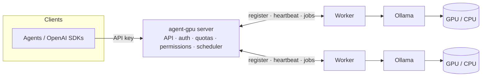

<p align="center">
  
</p>

# agent-gpu

[](https://github.com/jaypetez/agent-gpu/actions/workflows/ci.yml)
[](https://scorecard.dev/viewer/?uri=github.com/jaypetez/agent-gpu)
[](LICENSE)

**agent-gpu** is a distributed inference layer for [Ollama](https://ollama.com). It forwards
agent requests to remote GPU-powered Ollama instances and exposes a clean, OpenAI-compatible
API for running open-source LLMs across your network.

A central **server** owns the public API, authentication, quotas, permissions, and scheduling.
One or more **workers** run Ollama locally and execute inference jobs dispatched by the server.

## Why

- **Pool your GPUs.** One API endpoint backed by many machines. A capacity-aware
  scheduler routes each job by free VRAM and load, with a global queue and
  session-affinity so a conversation sticks to the worker that already has its
  context warm.
- **Made for agents.** OpenAI-compatible `/v1/chat/completions`, `/v1/completions`,
  and `/v1/models`, plus multi-turn **sessions** that keep history server-side.
- **Multi-tenant by design.** API keys with role-based permissions, per-model
  allow/deny lists, and per-key plus server-wide **quotas / rate limits** (with a
  `Retry-After` on throttle).
- **GPU-aware workers.** Workers drive a local [Ollama](https://ollama.com) and
  auto-detect the accelerator (NVIDIA / AMD / Apple, with a CPU fallback).
- **Operable.** A single `agentgpu` CLI, Prometheus `/metrics`, structured JSON
  logs with correlation IDs, an [OpenAPI 3.1 spec](openapi.yaml), and a built-in
  load-testing harness.
- **Runs anywhere.** A Docker Compose dev stack for one-command bring-up, two
  minimal container images, and standalone binaries for Windows/macOS/Linux
  (x64 + ARM64).

## Architecture



See [docs/architecture.md](docs/architecture.md) for the request-flow diagram and details.

## Install

Pre-built, statically-linked binaries are published for Windows, macOS, and Linux on both
x64 (`amd64`) and ARM64 from the
[Releases page](https://github.com/jaypetez/agent-gpu/releases).

1. Download the archive for your OS/arch (`agentgpu_<version>_<os>_<arch>.tar.gz`, or `.zip`
   on Windows).
2. Verify it against the published `checksums.txt`:

   ```bash
   # Linux / macOS
   sha256sum --check --ignore-missing checksums.txt
   ```

   ```powershell
   # Windows (PowerShell)
   (Get-FileHash .\agentgpu_<version>_windows_amd64.zip -Algorithm SHA256).Hash
   ```

3. Extract the archive and put the `agentgpu` binary on your `PATH`, then confirm it runs:

   ```bash
   agentgpu --version
   ```

Alternatively, install from source with the Go toolchain:

```bash
go install github.com/jaypetez/agent-gpu/cmd/agentgpu@latest
```

## Quickstart

The fastest path to a successful inference call is **Docker Compose**: it brings
up the server, a worker, and a local Ollama, and pulls a tiny model
(`qwen2:0.5b`, ~350 MB) automatically, so there is something to serve out of the
box. You need only Docker.

```bash
# 1. Clone and bring the whole stack up (server + worker + Ollama + backing services).
git clone https://github.com/jaypetez/agent-gpu.git
cd agent-gpu
docker compose up -d --build

# 2. Wait for the server: an unauthenticated GET /v1/models returns 401 once it is up.
until [ "$(curl -s -o /dev/null -w '%{http_code}' http://localhost:8080/v1/models)" = "401" ]; do
  sleep 2
done
```

There is no auto-seeded admin key, and before any key exists there is no token to
authenticate with — so bootstrap the first keys directly into the on-disk store
with `--local`, then **restart the server once** so it loads them at boot (the
file store is read only at startup). The plaintext token is printed **once** —
save it.

```bash
# 3. Mint an admin key and a user key scoped to the demo model, then restart so they load.
docker compose exec -T server /agentgpu key create --name admin --role admin --local
docker compose exec -T server /agentgpu key create --name app --role user --allow-model qwen2:0.5b --local
docker compose restart server
# Copy the "Token: ..." line from the user-key output into USER_TOKEN below.
export USER_TOKEN=<the user token printed above>
```

```bash
# 4. Wait until the model is advertised to your key (the worker discovers it from
#    Ollama, and ollama-init's pull can take a while on a cold cache).
until curl -s -H "Authorization: Bearer $USER_TOKEN" http://localhost:8080/v1/models \
  | grep -q '"id":"qwen2:0.5b"'; do sleep 2; done

# 5. Make an OpenAI-compatible chat request — this is your successful inference call.
curl -s http://localhost:8080/v1/chat/completions \
  -H "Authorization: Bearer $USER_TOKEN" \
  -H "Content-Type: application/json" \
  -d '{"model":"qwen2:0.5b","messages":[{"role":"user","content":"Say hi in one word."}]}'

# When you are done:
docker compose down -v   # stop the stack and remove its volumes
```

After step 3 you can manage the **running** server over its HTTP admin API with
the admin token (`key revoke`, `quota set`, permission changes — all immediate,
no restart). The full Compose walkthrough — managing live keys, scaling workers,
persistence, and GPU access — is in [docs/docker.md](docs/docker.md), and
`make compose-e2e` runs this exact flow end to end as a smoke test.

### Quickstart from source (no Docker)

With the [Go toolchain](#install) and a local [Ollama](https://ollama.com), run
the same flow by hand. Every command is a subcommand of the one `agentgpu`
binary (`go run ./cmd/agentgpu …` from a clone works too).

```bash
# 1. Bootstrap the first admin key into the on-disk store BEFORE the server runs;
#    --local writes the key file the server loads at boot.
agentgpu key create --name bootstrap --role admin --local   # -> prints a one-time token; save it

# 2. Start the server (HTTP API on :8080, gRPC control plane on :50051).
agentgpu server start

# 3. In another shell, start a worker pointed at the gRPC control plane and Ollama.
#    --server here is the gRPC host:port; --ollama-url is the local Ollama.
agentgpu worker start --server 127.0.0.1:50051 --ollama-url http://localhost:11434

# 4. Point the CLI at the RUNNING server and mint a user key over the admin API.
export AGENTGPU_HTTP_ADDR=http://127.0.0.1:8080
export AGENTGPU_TOKEN=<the admin token from step 1>
agentgpu key create --name my-agent --role user --allow-model llama3   # -> prints the user token
agentgpu models list                                                   # the permitted catalog

# 5. Make an OpenAI-compatible request with the user token (use a model your
#    worker serves — pull one first with `ollama pull llama3`).
curl http://127.0.0.1:8080/v1/chat/completions \
  -H "Authorization: Bearer <the user token from step 4>" \
  -H "Content-Type: application/json" \
  -d '{"model":"llama3","messages":[{"role":"user","content":"Hello!"}]}'
```

After step 4 the CLI manages the **running** server over its HTTP admin API, so
`key revoke`, `quota set`, and permission changes take effect immediately (no
restart). See [CLI](#cli) for the full command reference and
[docs/developer-guide.md](docs/developer-guide.md) for a deeper from-source
walkthrough.

### CLI

`agentgpu` is a single binary with subcommands. `server start` and `worker start`
run the long-lived processes; `key`, `quota`, and `models` are operator commands.

By default the operator commands act against a **running server** over its public
HTTP admin API, so changes are immediate. Configure the target with
flag > environment > default:

| Flag | Environment | Default | Purpose |
| --- | --- | --- | --- |
| `--server` / `--url` | `AGENTGPU_HTTP_ADDR` | `http://127.0.0.1:8080` | HTTP API base URL |
| `--token` | `AGENTGPU_TOKEN` | _(none)_ | admin Bearer token |
| `--store` | `AGENTGPU_STORE_PATH` | `~/.agentgpu/keys.json` | on-disk keys file (used with `--local`) |

```bash
# Keys (against a running server; needs an admin --token / $AGENTGPU_TOKEN)
agentgpu key create --name app --role user [--allow-model m] [--deny-model m]
agentgpu key list
agentgpu key revoke <id>          # invalidates the key immediately
agentgpu key rotate <id>          # new one-time token; old token stops working
agentgpu key perms <id> --role user --allow-model llama3

# Quotas (immediate, enforced updates)
agentgpu quota set <id> --rpm 60 --tpm 1000 [--daily-tokens N] [--monthly-tokens N]
agentgpu quota set <id> --clear   # revert to the global defaults
agentgpu quota show <id>          # usage vs limits

# Catalog
agentgpu models list              # operator table (NAME, DIGEST, WORKERS)
agentgpu models list --json       # raw /models JSON
agentgpu models list --openai     # OpenAI-canonical /v1/models JSON
```

**Offline bootstrap.** Before any server is running there is no admin token to
authenticate with, so mint the first admin key directly into the on-disk store
with `--local` (as in step 1 above). `--local` works without a server or token;
because the server only reads the store at boot, a `--local` change to an
already-running server takes effect after a restart. Use the HTTP mode (a
`--token`) to manage a live server. The `key` and `quota` commands accept
`--local`; `models list` is HTTP-only (the catalog only exists on a running
server).

The created/rotated **token is printed exactly once** and is never stored or
shown again; `key list` shows metadata only and never a secret.

Commands return distinct exit codes so scripts can branch: `0` success
(including `--help`), `1` general error, `2` usage error, `3` auth failure
(401/403), `4` not found (404), `5` could not reach the server. Run
`agentgpu <command> --help` for per-command flags.

### Run with Docker

The [Quickstart](#quickstart) above uses the Docker Compose dev stack, which is
the fastest way to a working server, worker, and Ollama in one command. Scale
workers with `docker compose up -d --scale worker=3`. The full guide (managing
live keys, persistence demo, GPU access) is in [docs/docker.md](docs/docker.md).

To wire agent-gpu into your own infrastructure, run the two minimal, non-root
images directly. They are built from one multi-stage [`Dockerfile`](Dockerfile)
and published to GHCR on each release:

```bash
# Server: the public API + control plane. /data holds key/quota/session state.
docker run -d -p 8080:8080 -p 50051:50051 -v agentgpu-data:/data \
  ghcr.io/jaypetez/agent-gpu/server:latest

# Worker: point it at the server (gRPC host:port) and an Ollama that owns the GPU.
docker run -d \
  -e AGENTGPU_SERVER_ADDR=server-host:50051 \
  -e AGENTGPU_OLLAMA_URL=http://host.docker.internal:11434 \
  ghcr.io/jaypetez/agent-gpu/worker:latest
```

To build locally instead, select a target: `docker build --target server -t
agentgpu-server .` (or `--target worker`). Two things to know in containers: the
server image already binds `0.0.0.0` (the binary defaults to loopback), and the
worker's `AGENTGPU_OLLAMA_URL` must **not** be `localhost` (that is the worker
container itself) — use the Ollama service name or `host.docker.internal`. See
[docs/docker.md](docs/docker.md) for the full guide.

## Documentation

- [Architecture](docs/architecture.md) — the implemented design, request flow, and scheduler.
- [API Reference](docs/api-reference.md) — the HTTP surface, generated from [`openapi.yaml`](openapi.yaml).
- [Developer Guide](docs/developer-guide.md) — build, run, and contribute to the code.
- [Running with Docker](docs/docker.md) — the container images and the Compose dev stack.
- [Metrics (Prometheus)](docs/metrics.md) — the `/metrics` endpoint and its reference.
- [Testing](docs/testing.md) · [Load testing](docs/load-testing.md) — the test suite and the perf harness.
- [Releasing](docs/releasing.md) — cutting a release with GoReleaser.
- [Contributing](CONTRIBUTING.md) · [Support](SUPPORT.md) · [Changelog](CHANGELOG.md)

## Project status

Early development. Work is tracked as GitHub Issues grouped into milestones (epics) on the
[**agent-gpu roadmap**](https://github.com/users/jaypetez/projects/10) board. Contributions welcome —
see [CONTRIBUTING.md](CONTRIBUTING.md).

## License

See [LICENSE](LICENSE).
