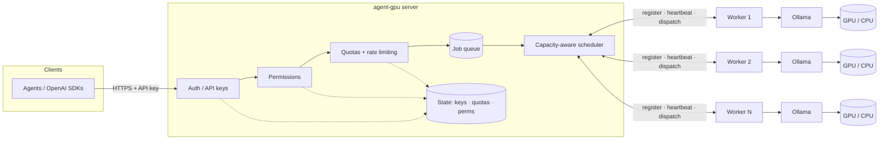
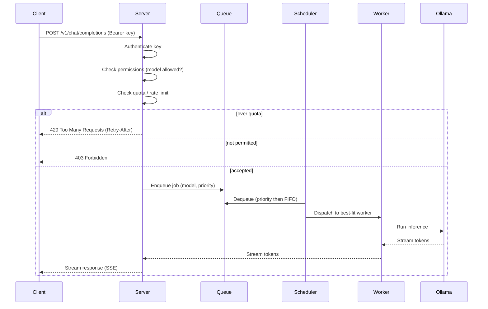

# Architecture

agent-gpu uses a **server + worker** model.

- **Server** — the single entry point. Owns the public API, authenticates API keys, enforces
  permissions and quotas, maintains the job queue, and schedules jobs onto workers.
- **Worker** — runs on any machine with [Ollama](https://ollama.com). Registers with the server,
  reports its capacity via heartbeats, and executes inference jobs against local Ollama.

## System overview

Workers continuously report GPU type, total/free VRAM, current load, active job count, and the
set of models they have available. The scheduler uses these signals — plus the requesting key's
priority — to route each job to a best-fit worker.

## Request flow

## Capacity-aware scheduling

For each job the scheduler scores candidate workers by:

1. **Model availability** — prefer workers that already have the model loaded.
2. **Free VRAM** — the model must fit; larger models go only where they fit.
3. **Current load / active jobs** — spread work and avoid hotspots.
4. **API-key priority** — higher-priority keys win under contention.

If no worker currently fits, the job is **queued** (never silently dropped) and re-evaluated as
capacity frees up. Queue depth and per-worker load are exported as metrics.

## State

Authentication, permission rules, and quota counters are persisted so they survive restarts.
The Docker Compose environment backs this with Redis/Postgres; standalone deployments may use an
embedded store. See the relevant milestones on the roadmap for specifics.

<!-- ci: ruleset + admin-merge verification -->
