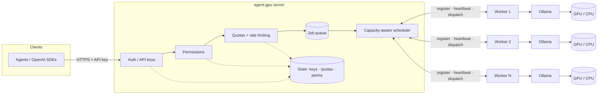
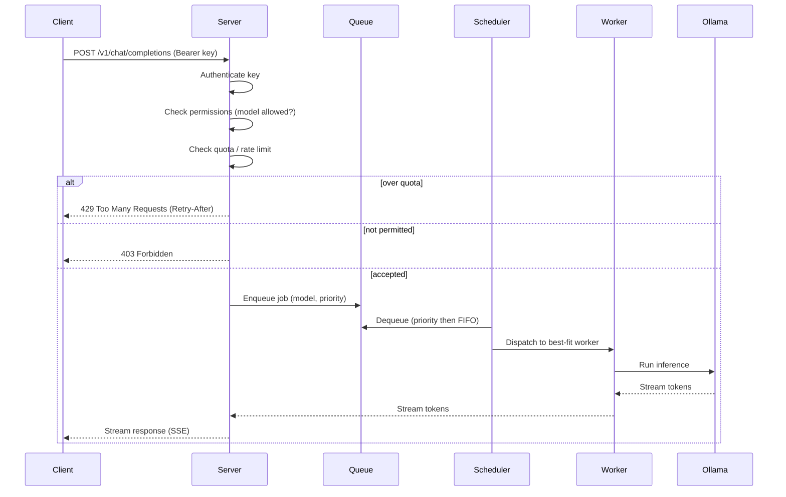

# Architecture

agent-gpu uses a **server + worker** model.

- **Server** — the single entry point. Owns the public API, authenticates API keys, enforces
  permissions and quotas, maintains the job queue, and schedules jobs onto workers.
- **Worker** — runs on any machine with [Ollama](https://ollama.com). Registers with the server,
  reports its capacity via heartbeats, and executes inference jobs against local Ollama.

## System overview



Workers continuously report GPU type, total/free VRAM, current load, active job count, and the
set of models they have available. The scheduler uses these signals — plus the requesting key's
priority — to route each job to a best-fit worker.

## Request flow



## Capacity-aware scheduling

For each job the scheduler scores candidate workers by:

1. **Model availability** — prefer workers that already have the model loaded.
2. **Free VRAM** — the model must fit; larger models go only where they fit.
3. **Current load / active jobs** — spread work and avoid hotspots.
4. **API-key priority** — higher-priority keys win under contention.

If no worker currently fits, the job is **queued** (never silently dropped) and re-evaluated as
capacity frees up. Queue depth and per-worker load are exported as metrics.

## Job queue

The global job queue (`internal/queue`) is the in-memory holding area the capacity-aware scheduler
draws from. It is a standalone, concurrency-safe data structure — it owns ordering and backpressure;
it does **not** choose which worker runs a job (that is the scheduler's job) and is not wired into
the dispatch path here.

- **Priority then FIFO.** Three named levels — `PriorityLow` (0), `PriorityNormal` (1, the default),
  `PriorityHigh` (2) — where **higher value is served first**. Within a single level, jobs are served
  strictly first-in-first-out. FIFO-within-level is guaranteed by a monotonic per-queue sequence
  number stamped at enqueue time, so equal-priority jobs always leave in the order they arrived
  regardless of goroutine scheduling. The backing store is a binary heap ordered by
  *(priority descending, sequence ascending)*.
- **Backpressure.** A queue may be bounded with `WithMaxDepth(n)` (`n <= 0` means unbounded). When a
  bounded queue is full, `Enqueue` does **not** block the caller — it returns `ErrQueueFull`
  immediately, the typed seam the request path maps to an explicit 503/429 rather than stalling.
- **Blocking dequeue.** `Dequeue` is non-blocking and reports whether an item was available.
  `DequeueWait(ctx)` blocks (on a condition variable) until an item is available, the context is done
  (returns `ctx.Err()`), or the queue is closed (returns `ErrClosed`) — the seam the scheduler loop
  parks on.
- **Observable depth.** `Len()` returns the total pending count and `Stats()` returns the total plus
  a per-priority breakdown. (Prometheus export is #24; the queue exposes plain methods, not a metrics
  hook.)
- **Concurrency.** All state is guarded by a single mutex paired with a condition variable, so
  enqueue and dequeue are fully atomic: under concurrency no job is lost and none is dequeued twice.
  `Close()` wakes every blocked waiter and is idempotent.

The queue is in-memory only and starts empty on every restart; persistence is out of scope.

## Worker lifecycle / heartbeats

Each worker holds one long-lived bidirectional stream to the server and moves through a small
lifecycle the server tracks in its in-memory fleet view (`Server.Fleet()`):

1. **Registration.** The worker's first message is a `Register` (worker id + advertised models). The
   server acknowledges with a `RegisterAck` carrying a session id and adds the worker to the
   registry as **online**.
2. **Heartbeats.** The worker sends a `Heartbeat` every `heartbeat interval` (default **15s**,
   configurable via `--heartbeat-interval` / `AGENTGPU_HEARTBEAT_INTERVAL`). Each heartbeat reports
   liveness plus capacity signals: GPU type, total/free VRAM, a coarse load value (0–100), the
   current active-job count, and the models the worker has available. The server folds these into
   the worker's fleet entry and stamps its last-seen time. (Real GPU detection arrives with a later
   epic; until then capacity fields are configured/stub values.)
3. **Stale eviction.** A background loop on the server marks a worker **stale** and evicts it once it
   has gone longer than the `heartbeat timeout` without a heartbeat (default **45s** — three missed
   intervals — configurable via `--heartbeat-timeout` / `AGENTGPU_HEARTBEAT_TIMEOUT`). Eviction
   removes the worker from the registry, stops routing to it, and fails any of its in-flight jobs
   with a `worker_stale` error so callers are not left hanging. The loop re-checks roughly every
   `timeout / 2`.
4. **Graceful drain / deregister.** On graceful shutdown a worker sends a `Deregister` before
   closing its stream; an operator can also drain a worker out-of-band (admin seam). A draining
   worker is **skipped by the router for new jobs** but its already-dispatched, in-flight jobs are
   allowed to finish; it is removed once its stream closes.

The router only ever selects workers that are neither draining nor stale. Selecting *which* healthy
worker should run a job (the capacity-aware scoring above) is a separate concern; until it lands the
router picks any healthy worker.

The lifecycle states are summarized below:

```text
online   -> stale     (missed heartbeats past the timeout; evicted, pending jobs fail)
online   -> draining  (Deregister or admin drain; no new jobs, in-flight jobs finish)
draining -> removed   (stream closes after in-flight jobs drain)
stale    -> removed   (evicted by the background loop)
```

## Permissions

Authentication (who you are, `internal/auth`) and authorization (what you may do,
`internal/authz`) are deliberately separate. Once a request is authenticated, the authorizer
decides whether the key may perform an **action** — `pull`, `load`, or `infer` — against a named
model, mapping a refusal to `ErrForbidden` (the future HTTP 403, mirroring
`ErrUnauthenticated` → 401).

Each API key carries built-in **roles** plus per-key **allow** and **deny** model lists. Three
roles ship today:

| role        | pull | load | infer | scope                                            |
| ----------- | ---- | ---- | ----- | ------------------------------------------------ |
| `admin`     | yes  | yes  | yes   | all models (ignores allow/deny lists)            |
| `user`      | yes  | yes  | yes   | only models on the key's allow-list              |
| `read-only` | no   | no   | yes   | only models on the key's allow-list              |

Access is **deny-by-default**: a key with no role and no allow-list can do nothing. Every decision
is evaluated against a fixed, deny-wins **precedence order**, returning at the first rule that
fires:

1. model in the key's **deny-list** → **DENY**
2. role `admin` → **ALLOW** (any model, any action)
3. role forbids the action (e.g. `read-only` attempting pull/load) → **DENY**
4. model in the key's **allow-list** (and a granting role is held) → **ALLOW**
5. otherwise → **DENY**

Every decision — granted or denied — is written to the structured audit log with the key id, model,
operation, reason, and (where relevant) role. Denials log at `warn`, grants at `info`. Secrets,
tokens, and hashes are never logged; only the opaque key id.

Permissions are read fresh from the store on every check, so role and list changes take effect
immediately without a restart. Until the admin HTTP endpoints land, roles and lists are managed
with the `agentgpu key create` and `agentgpu key perms` CLI commands.

## Quotas

After a request is authenticated and authorized, the quota engine (`internal/quota`) enforces
per-key **consumption limits**. A request that exceeds a limit is refused with `ErrQuotaExceeded`
— the typed seam the request path maps to HTTP **429** (mirroring `ErrUnauthenticated` → 401 and
`ErrForbidden` → 403). On the dispatch path the order is:

```text
authenticate → authorize → quota.CheckAndReserve → dispatch → quota.RecordTokens
```

`CheckAndReserve` runs **before** dispatch (a refused request never reaches a worker) and reserves
one request against the key's RPM; `RecordTokens` runs **after** the job returns and records the
tokens it actually produced. A request therefore always consumes one RPM unit (the attempt), but
only consumes token budget if the job produced tokens — a failed/zero-token job spends no token
budget.

### Limits

Four dimensions are enforced, each independently:

| dimension       | window | `0` means    |
| --------------- | ------ | ------------ |
| `RPM`           | minute | unlimited    |
| `TPM`           | minute | unlimited    |
| `DailyTokens`   | day    | unlimited    |
| `MonthlyTokens` | month  | unlimited    |

A zero value for any dimension means **unlimited** for that dimension. Limits attach to the key
(`store.APIKey.Limits`): a `nil` override means "use the global defaults" (`--default-rpm`,
`--default-tpm`, … / `QuotaConfig`); a non-nil value overrides the defaults wholesale. Limits are
read fresh from the store on every request, so changes take effect without a restart. They are
managed with `agentgpu key quota set <id> [--rpm …] [--tpm …] [--daily-tokens …]
[--monthly-tokens …] [--clear]`, and inspected with `agentgpu key quota <id>`.

### Reset windows

Windows are **fixed/calendar windows aligned to UTC boundaries**, not continuously sliding: when
the clock crosses a boundary the allowance fully resets. The boundaries are:

- **minute** — the start of the UTC minute (RPM, TPM)
- **day** — UTC midnight, `00:00:00 UTC` (daily token budget)
- **month** — the 1st of the month at `00:00:00 UTC` (monthly token budget)

Token counts come from `JobResult.Tokens`, reported by the worker. The stub echo executor reports
the number of whitespace-separated tokens in its output so accounting is testable today; real
counts arrive with the Ollama integration.

### Persistence

Per-key **limits** change rarely and are persisted with the key in the JSON key store. Per-request
**counters** live in an in-memory, concurrency-safe `CounterStore` (a single mutex serializes
check-and-increment so counts stay exact under concurrency). To survive restarts without per-request
disk writes, the server **checkpoints** the counters to a JSON file (`--quota-path` /
`AGENTGPU_QUOTA_PATH`, default `~/.agentgpu/quota.json`) periodically and on graceful shutdown, and
loads the checkpoint on startup — rolling any windows that expired while the process was down. The
interface is shaped so a Redis-backed counter store (atomic `INCR` per window key) can slot in later
without touching the engine.

## State

Authentication, permission rules, and quota counters are persisted so they survive restarts.
The Docker Compose environment backs this with Redis/Postgres; standalone deployments may use an
embedded store. See the relevant milestones on the roadmap for specifics.

## Technology choices

### Language & runtime: Go

The whole project is a single Go module (`github.com/jaypetez/agent-gpu`) and ships as one binary
with `server` and `worker` subcommands.

- **I/O-bound gateway.** The server is a fan-out/fan-in proxy in front of GPU workers — its work is
  concurrent connections and streaming, not CPU. Go's goroutines and channels model "one stream per
  worker, many in flight" directly, without an async runtime or callback soup.
- **Single-binary, trivial cross-compile.** Operators run agent-gpu on Windows/macOS/Linux across
  x64 and ARM64. Go cross-compiles to all of those from one host with no runtime to install. We
  **avoid cgo** so `GOOS`/`GOARCH` cross-builds stay a one-liner and binaries stay static.
- **Typed contracts end to end.** The server↔worker protocol is defined once in protobuf and
  generated into Go, so both sides share the exact same types.

### Server↔worker transport: gRPC bidirectional streaming

The internal control plane between the server and each worker is **gRPC**, defined in the versioned
protobuf package [`agentgpu.v1`](../proto/agentgpu/v1/agentgpu.proto). Each worker opens **one
persistent bidirectional stream** (`ControlPlane.Connect`) that carries the full lifecycle:

```text
worker → server : Register → Heartbeat* → JobResult*
server → worker : RegisterAck → Job*
```

- **One long-lived stream, both directions.** Registration, heartbeats, job dispatch, and results
  all flow over the same connection — no per-job dials, no inbound port on the worker. Workers can
  sit behind NAT and still receive dispatched jobs because they initiated the stream.
- **Built-in keepalive + client-side reconnect.** gRPC keepalive detects dead links; the worker
  reconnects with **exponential backoff and full jitter**, so a transient drop is invisible to the
  control plane (the server simply re-registers the worker on the new stream).
- **Token streaming maps cleanly.** Streaming inference tokens from worker to server is a natural
  fit for a server-streaming response and is built on this same contract by a later epic.
- **Versioned, append-only contract.** The package is `agentgpu.v1`; every later epic extends these
  messages rather than breaking them. `buf` lints and (later) breaking-change-checks the schema.

> The **public client API stays HTTP and OpenAI-compatible** — gRPC is used only on the internal
> server↔worker hop, not by end users. The HTTP API is built in a separate epic.

### Proto code generation

Stubs under `proto/agentgpu/v1/*.pb.go` are generated and **committed**. Regenerate with
`make proto` (which runs `buf lint` + `buf generate`). Pinned tool versions:

| Tool                 | Version  |
| -------------------- | -------- |
| `buf`                | v1.50.0  |
| `protoc-gen-go`      | v1.36.6  |
| `protoc-gen-go-grpc` | v1.5.1   |

Install them with `make tools`.

<!-- ci: ruleset + admin-merge verification -->
