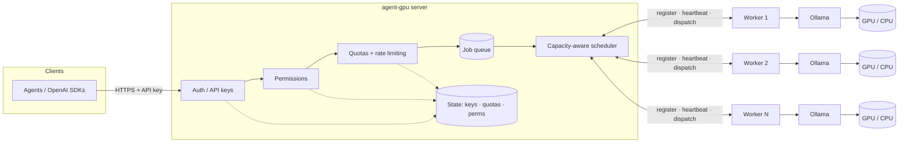
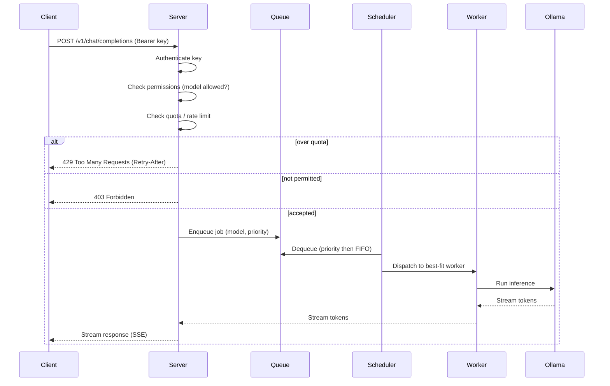

# Architecture

agent-gpu uses a **server + worker** model.

- **Server** — the single entry point. Owns the public API, authenticates API keys, enforces
  permissions and quotas, maintains the job queue, and schedules jobs onto workers.
- **Worker** — runs on any machine with [Ollama](https://ollama.com). Registers with the server,
  reports its capacity via heartbeats, and executes inference jobs against local Ollama.

## System overview



Workers continuously report GPU type, total/free VRAM, current load, active job count, and the
set of models they have available. The scheduler uses these signals — plus the requesting key's
priority — to route each job to a best-fit worker.

## Request flow



## HTTP API / model discovery

The public, client-facing surface is an HTTP server (`internal/httpapi`) — the first HTTP server in
the project; server↔worker traffic stays on gRPC. It is built on the standard library
(`net/http` + `http.ServeMux`, no framework) and is constructed with the control-plane server (for
the fleet snapshot), the `auth.Service` (to authenticate keys), and the **same** `authz.Authorizer`
the gRPC server uses to gate dispatch. Sharing the authorizer guarantees catalog visibility matches
dispatch-time authorization exactly: a model a key can see is a model it can invoke.

Listen address resolves flag > env > default: `--http-listen` / `AGENTGPU_HTTP_LISTEN` /
`127.0.0.1:8080`. The HTTP server starts alongside the gRPC server and, on shutdown, is drained
first (bounded `Shutdown` timeout) before the gRPC server stops.

### Bearer authentication

Every route is wrapped in a reusable auth middleware that extracts
`Authorization: Bearer <token>`, calls `auth.Service.Authenticate`, and stashes the resolved
`store.APIKey` on the request context for handlers. Failures map deterministically:

- missing / malformed header, or `auth.ErrUnauthenticated` → **401** (no detail leaked, no catalog
  exposed);
- any other authentication error → **500**.

The same middleware and the shared JSON/error helpers (`{"error":{"message","code"}}`) are the seam
the chat/completions path (#13) reuses, so authentication behaves identically across the API.

### Permission-filtered catalog

The catalog aggregates `Server.Fleet()`: it keeps only **Online** workers, deduplicates models by
name, and records per-model availability (worker count + ids). A model is included only if the
request's key passes `authz.Authorize(…, authz.Infer)` — the deny-wins precedence used at dispatch —
so a drained/stale/evicted worker's models disappear, a model on several workers collapses to one
entry, and models a key cannot use are hidden. Output is sorted by name for determinism.

### Endpoints

- `GET /v1/models` — OpenAI-canonical:
  `{"object":"list","data":[{"id":<name>,"object":"model","created":0,"owned_by":"agent-gpu"}]}`.
  `created` is a stable sentinel (`0`) because the domain model carries no creation time; keeping it
  fixed makes responses deterministic and cacheable.
- `GET /models` — richer internal shape:
  `{"models":[{"name":…,"digest":…,"worker_count":N,"workers":[ids]}]}`.

Both require a valid key and are permission-filtered per key. Responses never include secrets,
tokens, or hashes.

## OpenAI-compatible API

On top of model discovery, `internal/httpapi` serves the inference surface an unmodified OpenAI
client library can target with only a base-URL + key change: `POST /v1/chat/completions`,
`POST /v1/completions`, and the `GET /v1/models` catalog above. Every route is behind the same Bearer
auth middleware, and authorization + quota are enforced by the control-plane server's
`SubmitAuthorizedJob` / `SubmitAuthorizedJobStream` — the HTTP layer never re-implements them. The
inference parameters not yet plumbed to Ollama (`temperature`, `top_p`, `max_tokens`, …) are accepted
and ignored rather than rejected, so clients that send them still work; wiring them through is a
documented seam.

### Endpoints

- `POST /v1/chat/completions` — the chat surface. Request:
  `{"model","messages":[{role,content,name?,tool_call_id?,tool_calls?}],"stream"?,"tools"?}`.
  Non-streaming response is `object:"chat.completion"` with
  `choices:[{index,message:{role:"assistant",content,tool_calls?},finish_reason}]` and a `usage`
  object.
- `POST /v1/completions` — the legacy text-completion surface. The `prompt` maps onto the plain
  `Job.Prompt` path (no messages), so the foundational dispatch path and the echo stub run unchanged.
  Response is `object:"text_completion"` with `choices:[{text,index,finish_reason}]` and `usage`.
- `GET /v1/models` — the OpenAI-canonical catalog (see above), kept working unchanged.

Response `id`s are `chatcmpl-`/`cmpl-` (and an internal `job-` job id) plus `crypto/rand` hex, so they
are unguessable and globally unique without coordination; `created` is unix seconds.

### Request ↔ job mapping

The HTTP request is translated into a transport-neutral `types.Job` and threaded through the gRPC
control stream to the worker:

- chat → `Job.Messages` (the full conversation: `role`, `content`, and for tool turns `tool_call_id` /
  `name` / replayed `tool_calls`) plus `Job.Tools` (function definitions, `parameters` carried as an
  opaque JSON-schema string so the schema passes through unchanged). `Job.Prompt` is left empty.
- completion → `Job.Prompt`; `Messages`/`Tools` empty.

The worker's `OllamaExecutor` runs a chat job against Ollama `/api/chat` (which supports tools) with
the full message array, and a prompt-only job by wrapping the prompt as a single user turn. The proto
`Job`/`JobResult`/`JobChunk` were extended **additively** (new field numbers) with `messages`,
`tools`, `tool_calls`, `finish_reason`, and the `prompt_tokens`/`completion_tokens` split, so existing
prompt-only callers and the echo path are unaffected.

The response is built from the job result: assistant `content` from the accumulated output, assistant
`tool_calls` from the model's emitted calls (a missing id is filled with a generated `call_` id so
clients can correlate the subsequent tool-result message), and `finish_reason` from the worker's
mapped reason (`stop` / `length` / `tool_calls`; empty normalizes to `stop`). `usage` comes from
Ollama's `prompt_eval_count` / `eval_count`; when only a total is reported (e.g. the echo stub) it
lands in `completion_tokens` and `total_tokens` with `prompt_tokens` zero.

### SSE streaming

With `stream:true`, the handler calls `SubmitAuthorizedJobStream` — which authorizes and reserves
quota **before** any worker is touched — then subscribes to the job's live `JobChunk` stream and
emits Server-Sent Events. Headers (`Content-Type: text/event-stream`, `Cache-Control: no-cache`,
`Connection: keep-alive`) are written before the first frame, each frame is an
`data: <json>\n\n` line flushed via `http.Flusher` **as each chunk arrives** (no full-response
buffering), and the stream terminates with the literal `data: [DONE]\n\n` sentinel.

For chat the first frame carries `delta:{role:"assistant"}`, subsequent frames carry
`delta:{content:"…"}` (and/or `tool_calls`), the terminal chunk sets `finish_reason`, and every frame
is `object:"chat.completion.chunk"`. Completion frames are `object:"text_completion"` with the delta
in `choices[].text`. Cancelling the request context (client disconnect) propagates to
`SubmitAuthorizedJobStream`, which detaches the observer and aborts the upstream dispatch so the
worker can stop.

### Error → status mapping

Submit-path errors map to HTTP status with a stable machine `code` and a generic message (no internal
detail leaks):

| Error | Status | Code |
| --- | --- | --- |
| `auth.ErrUnauthenticated` (middleware) | 401 | `unauthorized` |
| `authz.ErrForbidden` | 403 | `forbidden` |
| `quota.ErrQuotaExceeded` | 429 | `rate_limit_exceeded` |
| `queue.ErrQueueFull` / `server.ErrShuttingDown` | 503 | `unavailable` |
| `types.ErrInvalidJob` / malformed body | 400 | `invalid_request_error` |
| anything else | 500 | `internal_error` |

For a streaming request the mapping applies only **before the first byte**: if gating fails the client
gets the JSON error + status as normal. Once SSE headers are sent, a mid-stream upstream failure is
surfaced as a terminal chunk with `finish_reason:"error"` followed by `[DONE]`, so the client's stream
parser ends cleanly rather than hanging.

### Out of scope / seams

The formal OpenAPI 3.1 spec (#14) is out of scope here; the typed `code`s, the `usage` object, and
the unplumbed inference parameters are the seams it lands on. Per-key quota is enforced (and
`429`-mapped) because `SubmitAuthorizedJob*` reserves against it, and the inference routes are
fronted by the global rate limiter with `Retry-After` on every `429` (see
[Rate limiting](#rate-limiting)).

## Admin API

The admin API (`internal/httpapi/admin.go`, #4) is the HTTP control surface for operating the
gateway: API-key lifecycle (CRUD), per-key quota overrides, roles + per-model allow/deny lists, and
fleet inspection/drain. It is a thin wrapper over the already-shipped implementations — `auth.Service`
(keys, permissions, limits), `quota.Engine` (usage snapshot), and `server.Server` (fleet + drain) —
so #4 adds only the HTTP surface, no new control-plane logic.

### Admin-role gating

Every admin route is mounted behind two middlewares: the shared `authMiddleware` (authenticate the
Bearer token → `401` on failure) and then `adminMiddleware`, which reads the authenticated key off
the request context and requires the `admin` role (`authz.RoleAdmin`) → `403` (`forbidden`)
otherwise. The two responses are cleanly separated: `401` means "who are you", `403` means "you may
not". An unauthenticated request never reaches the admin gate, and a non-admin key never reaches a
handler.

### Endpoints

| Method + path | Action |
| --- | --- |
| `POST /v1/admin/keys` | Create a key with roles + allow/deny lists → `201` with the one-time token |
| `GET /v1/admin/keys` | List all keys (metadata only) |
| `GET /v1/admin/keys/{id}` | Inspect one key |
| `DELETE /v1/admin/keys/{id}` | Revoke a key → `204` |
| `POST /v1/admin/keys/{id}/rotate` | Rotate the secret → new one-time token |
| `PUT /v1/admin/keys/{id}/permissions` | Replace roles + allow/deny lists |
| `PUT /v1/admin/keys/{id}/quota` | Set/clear the per-key quota override |
| `GET /v1/admin/keys/{id}/quota` | Usage snapshot vs effective limits + reset windows |
| `GET /v1/admin/workers` | Fleet snapshot |
| `POST /v1/admin/workers/{id}/drain` | Drain a worker → `204` |
| `GET /v1/admin/stats` | Consolidated monitoring: queue depth + per-worker load + time-in-queue distribution (see [Queue depth / monitoring](#queue-depth--monitoring)) |

`PUT .../permissions` is a full replace (not a merge): an omitted/null list clears that dimension.
`PUT .../quota` is per-dimension: an omitted field defaults to `0` ("unlimited" for that dimension),
and a body with **every** field omitted clears the per-key override entirely so the key falls back
to the global defaults.

### Immediate effect

Changes take effect with no restart. Authorization reads the key fresh from the store on every
dispatch and the quota engine reads its limits fresh on every check, so a deny-model set via
`PUT .../permissions` denies (`403`) the next inference, a `DELETE` revoke fails (`401`) the next
authenticated call, and an `RPM` set via `PUT .../quota` trips (`429`) within the same minute window
— all without bouncing the server.

### Error → status mapping

Admin errors use the same `{"error":{"message","code"}}` envelope as the rest of the API:

| Condition | Status | Code |
| --- | --- | --- |
| Non-admin key | 403 | `forbidden` |
| Unauthenticated (middleware) | 401 | `unauthorized` |
| `store.ErrNotFound` (unknown key) | 404 | `not_found` |
| `server.ErrWorkerNotFound` | 404 | `not_found` |
| Malformed JSON body | 400 | `invalid_request_error` |
| anything else | 500 | `internal_error` |

### No secret exposure

Responses are explicit request/response structs that project `store.APIKey` into a metadata-only
view — the stored `SecretHash`/`Salt` are **never** serialized or logged. The plaintext token is
returned exactly once, only on create and rotate; it cannot be recovered afterward.

The formal OpenAPI 3.1 spec for these endpoints lands in #14.

### Queue depth / monitoring

`GET /v1/admin/stats` (#10) is the operator-facing monitoring view: one consolidated JSON document
combining three live snapshots, read on every request (no caching) so the numbers track the fleet in
near-real-time. It is admin-gated like every other admin route (non-admin `403`, unauthenticated
`401`) and exposes no secrets. The same accessors are the instrumentation seam the Prometheus
`/metrics` endpoint (#24) will scrape.

- **Queue depth** — `Server.QueueStats()` returns `queue.Stats{Total, ByPriority}`: the global pending
  count and a per-priority breakdown. A growing backlog (jobs submitted while no worker can run them)
  is reflected immediately as `Total` rises; the breakdown attributes each queued job to its lane
  (`high`/`normal`/`low`). In the response: `queue.total` and `queue.by_priority`.
- **Per-worker load** — `Server.Fleet()` returns the live worker snapshots; the stats view projects
  each to `{id, active_jobs, load, status}` (the fuller VRAM/model detail stays on `GET
  /v1/admin/workers`). In the response: `workers[]`.
- **Time-in-queue distribution** — `Server.WaitTimeStats()` returns `WaitTimeStats{Count, SumMs, MaxMs,
  Buckets}`, a mutex-guarded counter recorded in the placement loop. When a job that **queued** is
  dispatched, the server records `now − EnqueuedAt` (both on the same injected clock): it bumps the
  count, adds the wait to the running sum, raises the max, and increments every cumulative `le`-bucket
  whose bound (`{10, 100, 1000, 10000}` ms) is `≥` the wait, plus a trailing `+Inf` bucket (`le_ms ==
  0`). Jobs dispatched on the synchronous fast path **never queued**, so their near-zero wait is
  deliberately **excluded** from the distribution. In the response: `wait_time.{count, sum_ms, max_ms,
  mean_ms, buckets[]}`, where `mean_ms = sum_ms / count` (`0` when `count == 0`).

Prometheus export (a registry and a `/metrics` endpoint scraping these accessors) is **out of scope**
here and deferred to #24; #10 provides the instrumentation and the JSON view over it.

## Capacity-aware scheduling

The scheduler (`internal/scheduler`) is the placement core: a **pure, deterministic** function that,
given a fleet snapshot (`Server.Fleet()`) and a target model, picks the best-fit worker. The server
consults it on every dispatch and from the background placement loop. Keeping the math pure (no
clock, no locks, no map-iteration-order dependence) makes the decision reproducible and unit-testable
in isolation from the server's concurrency.

### Runnable candidates

A worker is a candidate for a model only when it is **Online** (never `Draining` or `Stale` — the
liveness state computed in the fleet view) **and** it can plausibly run the model: either it already
has the model loaded **or** it reports free VRAM to load it.

### Scoring weights (highest influence first)

`Score(worker, model)` sums weighted terms, ordered by orders of magnitude so a higher term can never
be outweighed by the sum of every lower term in its expected range:

1. **Model already loaded** — *dominates everything else.* Reusing a loaded model avoids a cold
   load/reload, the single biggest latency win available today.
2. **More free VRAM** — headroom to load and run without thrashing.
3. **Lower load** — the worker's reported 0–100 utilization; prefer the least-busy GPU.
4. **Fewer active jobs** — final tie-break on raw concurrency.

`Pick` filters to runnable candidates, scores each, and returns the highest. **Ties are broken by
worker ID (ascending)** so the choice is stable across calls.

### Session affinity (warm KV cache)

A conversation's follow-up turns are routed back to the worker that already holds the session's model
(its warm KV cache), avoiding a cold prompt reprocess on a different GPU. Affinity is a **strong
preference, not a hard pin**:

- A `Session` records a `BoundWorkerID` — set on the **first turn** (after the first successful
  dispatch) and **rebound** whenever a different worker is chosen. A `types.Job` carries an optional
  `SessionID` that is a **server-side routing hint only**: it never crosses the gRPC wire to the worker
  (`Job.Proto` omits it), so the worker contract is unchanged.
- `scheduler.PickPreferring(workers, model, preferredWorkerID)` adds a **bound-worker bonus**
  (`weightBoundWorkerBonus`, 1e8) to the bound worker **only when it is already in the runnable
  candidate set**. The bonus sits **between** the capacity terms and the model-loaded weight (1e9): a
  warm bound worker reliably wins over a fresher peer, but a *different* worker that already has the
  model loaded still wins, and the bonus **never** makes a draining/stale/VRAM-unfit worker selectable
  (the runnability filter is untouched). `Pick` is `PickPreferring` with no preference, so the
  no-session path is byte-identical and `Pick`/`Score` stay pure and deterministic.
- **Rebind on loss.** When the bound worker drains, is evicted, goes stale, or no longer fits, it is
  simply not a candidate, so the best-fit healthy worker is chosen and the session is rebound to it —
  the next turn succeeds on a new worker with no client-visible failure.
- Resolving the binding and recording it is **server-side bookkeeping**: the dispatch paths
  (`submit` fast path, the placement loop, and the streaming path) look the session up by the owning
  key id, pass its `BoundWorkerID` as the preference, and after a successful dispatch `Bind` the
  session (first-turn or rebind). A bind error is logged and **never fails the inference turn**.
- **Affinity metric.** `Server.AffinityStats()` exposes mutex-guarded `Hits`/`Misses`: a **hit** when a
  turn routes back to its bound worker, a **miss** when it rebinds to a different one. A session's first
  turn (no prior binding) and any session-less job count neither. It is the metrics seam for #24.

### Fit approximation (no model-size data yet)

There is no per-model VRAM-requirement data yet (real GPU/model-size detection is #16), so "fit" is
approximated as **`FreeVRAM > 0`** (or the model already being loaded). When real footprints land, the
runnability filter and the VRAM term should compare against the model's actual size rather than a
non-zero check.

### API-key priority under contention

Priority is carried by the **queue** (higher priority dequeued first), not by the scoring function.
The per-job priority is derived from the owning key's roles at enqueue time by
`scheduler.PriorityForRoles`, the single centralized (interim) mapping until an explicit per-key
priority field exists:

| Roles | Queue priority |
| --- | --- |
| `admin` | `PriorityHigh` |
| `user` | `PriorityNormal` |
| `read-only` / no roles | `PriorityLow` |

(When a key holds several roles, the highest-implied priority wins.) Keyless internal submits default
to `PriorityNormal`.

### Queue-on-miss and re-evaluation

If no worker fits at submit time the job is **queued, never silently dropped**, and the caller blocks
on a server-level waiter keyed by job ID. A background **placement loop** (mirroring the eviction
loop's `Start`/`Close` lifecycle, clock-injected) dequeues the highest-priority job, waits for a
runnable worker, dispatches it, and resolves the same waiter the caller holds — so each queued job is
dispatched **exactly once**. The loop is woken promptly by a coalescing **capacity signal** raised
whenever capacity may have increased (a heartbeat applied, a job completed, a worker registered), with
a bounded periodic re-check as a backstop. A bounded queue at depth rejects further submits with
`queue.ErrQueueFull` (backpressure) rather than blocking; a cancelled caller drops its waiter so
nothing leaks, and shutdown releases any still-blocked callers.

`Server.QueueStats()` exposes queue depth (total + per-priority breakdown) and enqueue/placement
events are logged via structured `slog` (`key_id`, `model`, `priority`, `reason`; never secrets).

### Future work

- **Anti-starvation / aging.** Strict priority can starve low-priority jobs under sustained
  contention; aging a job's effective priority by its queue wait time is the planned mitigation.
- **Real VRAM-fit.** Replace the `FreeVRAM > 0` approximation with a comparison against each model's
  actual VRAM footprint once model-size detection (#16) lands.
- **Metrics export.** Queue depth and per-worker load become Prometheus metrics in #24; today they
  are plain methods (`QueueStats`) and structured logs.

## Job queue

The global job queue (`internal/queue`) is the in-memory holding area the capacity-aware scheduler
draws from. It is a standalone, concurrency-safe data structure — it owns ordering and backpressure;
it does **not** choose which worker runs a job (that is the scheduler's job) and is not wired into
the dispatch path here.

- **Priority then FIFO.** Three named levels — `PriorityLow` (0), `PriorityNormal` (1, the default),
  `PriorityHigh` (2) — where **higher value is served first**. Within a single level, jobs are served
  strictly first-in-first-out. FIFO-within-level is guaranteed by a monotonic per-queue sequence
  number stamped at enqueue time, so equal-priority jobs always leave in the order they arrived
  regardless of goroutine scheduling. The backing store is a binary heap ordered by
  *(priority descending, sequence ascending)*.
- **Backpressure.** A queue may be bounded with `WithMaxDepth(n)` (`n <= 0` means unbounded). When a
  bounded queue is full, `Enqueue` does **not** block the caller — it returns `ErrQueueFull`
  immediately, the typed seam the request path maps to an explicit 503/429 rather than stalling.
- **Blocking dequeue.** `Dequeue` is non-blocking and reports whether an item was available.
  `DequeueWait(ctx)` blocks (on a condition variable) until an item is available, the context is done
  (returns `ctx.Err()`), or the queue is closed (returns `ErrClosed`) — the seam the scheduler loop
  parks on.
- **Observable depth.** `Len()` returns the total pending count and `Stats()` returns the total plus
  a per-priority breakdown. (Prometheus export is #24; the queue exposes plain methods, not a metrics
  hook.)
- **Concurrency.** All state is guarded by a single mutex paired with a condition variable, so
  enqueue and dequeue are fully atomic: under concurrency no job is lost and none is dequeued twice.
  `Close()` wakes every blocked waiter and is idempotent.

The queue is in-memory only and starts empty on every restart; persistence is out of scope.

## Worker lifecycle / heartbeats

Each worker holds one long-lived bidirectional stream to the server and moves through a small
lifecycle the server tracks in its in-memory fleet view (`Server.Fleet()`):

1. **Registration.** The worker's first message is a `Register` (worker id + advertised models). The
   server acknowledges with a `RegisterAck` carrying a session id and adds the worker to the
   registry as **online**.
2. **Heartbeats.** The worker sends a `Heartbeat` every `heartbeat interval` (default **15s**,
   configurable via `--heartbeat-interval` / `AGENTGPU_HEARTBEAT_INTERVAL`). Each heartbeat reports
   liveness plus capacity signals: GPU type, total/free VRAM, a coarse load value (0–100), the
   current active-job count, and the models the worker has available. The server folds these into
   the worker's fleet entry and stamps its last-seen time. (Real GPU detection arrives with a later
   epic; until then capacity fields are configured/stub values.)
3. **Stale eviction.** A background loop on the server marks a worker **stale** and evicts it once it
   has gone longer than the `heartbeat timeout` without a heartbeat (default **45s** — three missed
   intervals — configurable via `--heartbeat-timeout` / `AGENTGPU_HEARTBEAT_TIMEOUT`). Eviction
   removes the worker from the registry, stops routing to it, and fails any of its in-flight jobs
   with a `worker_stale` error so callers are not left hanging. The loop re-checks roughly every
   `timeout / 2`.
4. **Graceful drain / deregister.** On graceful shutdown a worker sends a `Deregister` before
   closing its stream; an operator can also drain a worker out-of-band (admin seam). A draining
   worker is **skipped by the router for new jobs** but its already-dispatched, in-flight jobs are
   allowed to finish; it is removed once its stream closes.

The router only ever selects workers that are neither draining nor stale. Selecting *which* healthy
worker should run a job (the capacity-aware scoring above) is a separate concern; until it lands the
router picks any healthy worker.

The lifecycle states are summarized below:

```text
online   -> stale     (missed heartbeats past the timeout; evicted, pending jobs fail)
online   -> draining  (Deregister or admin drain; no new jobs, in-flight jobs finish)
draining -> removed   (stream closes after in-flight jobs drain)
stale    -> removed   (evicted by the background loop)
```

## Ollama integration

Each worker runs inference against a **local Ollama instance** it reaches over Ollama's REST API
(default `http://localhost:11434`, configurable via `--ollama-url` / `AGENTGPU_OLLAMA_URL`). The
integration lives in two layers: `internal/ollama` is a thin stdlib-`net/http` client for Ollama;
`worker.OllamaExecutor` adapts it to the worker's `Executor` interface. The echo executor remains the
default test stub and implements the same interface.

### Backend detection and model listing

On startup the worker probes `GET /api/version`. If Ollama answers, the worker logs the version and
seeds its model cache from `GET /api/tags`. If Ollama is **unreachable**, the worker logs a clear
warning and continues **degraded** — it still registers and heartbeats (advertising whatever models
it last knew, possibly none) rather than crashing, so the fleet sees the worker and it recovers once
Ollama comes back. The worker refreshes the model cache before each heartbeat, so the server's fleet
view reflects models being pulled or removed without re-registration. The `--models` flag is a
fallback/override that seeds the advertisement until `/api/tags` is reachable.

### Streaming inference (worker → server)

Inference output is carried as a **true token stream**, not a single final result. The worker runs
`POST /api/chat` with `stream: true`, decodes the NDJSON response line-by-line, and emits one
`JobChunk{delta}` per produced token over the control stream, followed by a terminal
`JobChunk{done=true, tokens=N}` (or `{done=true, error=...}` on failure). The token count is Ollama's
`eval_count + prompt_eval_count` from the terminal object, not a guess.

The server **accumulates** chunks per `job_id` into a per-job buffer and, on the terminal chunk,
resolves the existing pending waiter with the final `JobResult` (accumulated output + tokens, or the
error). `SubmitJob` therefore stays **synchronous** — it still returns one final result — while the
wire carries an incremental stream. A failed inference always produces a terminal error chunk, so a
waiter is resolved exactly once and never hangs. (The client-facing SSE forwarding of these chunks is
the OpenAI-API epic, #13; carrying a real stream now is why that hop is incremental rather than a
single result.)

```text
Ollama NDJSON     worker emits            server accumulates        SubmitJob caller
--------------    --------------------    ----------------------    -------------------
{content:"po"} -> JobChunk{delta:"po"} -> buf["job"]="po"
{content:"ng"} -> JobChunk{delta:"ng"} -> buf["job"]="pong"
{done,eval=3}  -> JobChunk{done,tok=5} -> resolve(JobResult{...}) -> returns "pong", 5 tokens
```

### Permission-gated pull

A model is fetched onto a worker via `Server.PullModel(ctx, key, workerID, model)`. It mirrors the
dispatch path's authorize-before-act ordering: it calls `authz.Authorize(key, model, authz.Pull)`
first, and a denied key returns `authz.ErrForbidden` with **no** `PullModel` message sent — so an
unauthorized caller never reaches Ollama's `/api/pull`. A permitted pull sends a fire-and-forget
`PullModel` control message; the worker drives `POST /api/pull` (draining its NDJSON progress stream)
and advertises the new model on its next heartbeat. Auto-pull on a dispatch miss is intentionally a
**seam**, not built here.

### Error contract

Ollama failures map onto `types.JobError` with stable, machine-readable codes the request path (#13)
can translate to HTTP statuses:

```text
model_not_found     model is not present on the worker (404, or "not found" in the body/stream)
ollama_unreachable  the Ollama server could not be contacted (connection refused, DNS, etc.)
ollama_error        a generic Ollama-reported failure with no more specific code
timeout             the context deadline was exceeded or the job was cancelled mid-stream
invalid_request     Ollama rejected the request as malformed (400)
```

Long inference is bounded by the **caller's context**, not a short global HTTP timeout, so a slow
generation is not spuriously killed; cancelling the context aborts the in-flight HTTP request and
stops emitting.

## Permissions

Authentication (who you are, `internal/auth`) and authorization (what you may do,
`internal/authz`) are deliberately separate. Once a request is authenticated, the authorizer
decides whether the key may perform an **action** — `pull`, `load`, or `infer` — against a named
model, mapping a refusal to `ErrForbidden` (the future HTTP 403, mirroring
`ErrUnauthenticated` → 401).

Each API key carries built-in **roles** plus per-key **allow** and **deny** model lists. Three
roles ship today:

| role        | pull | load | infer | scope                                            |
| ----------- | ---- | ---- | ----- | ------------------------------------------------ |
| `admin`     | yes  | yes  | yes   | all models (ignores allow/deny lists)            |
| `user`      | yes  | yes  | yes   | only models on the key's allow-list              |
| `read-only` | no   | no   | yes   | only models on the key's allow-list              |

Access is **deny-by-default**: a key with no role and no allow-list can do nothing. Every decision
is evaluated against a fixed, deny-wins **precedence order**, returning at the first rule that
fires:

1. model in the key's **deny-list** → **DENY**
2. role `admin` → **ALLOW** (any model, any action)
3. role forbids the action (e.g. `read-only` attempting pull/load) → **DENY**
4. model in the key's **allow-list** (and a granting role is held) → **ALLOW**
5. otherwise → **DENY**

Every decision — granted or denied — is written to the structured audit log with the key id, model,
operation, reason, and (where relevant) role. Denials log at `warn`, grants at `info`. Secrets,
tokens, and hashes are never logged; only the opaque key id.

Permissions are read fresh from the store on every check, so role and list changes take effect
immediately without a restart. Until the admin HTTP endpoints land, roles and lists are managed
with the `agentgpu key create` and `agentgpu key perms` CLI commands.

## Quotas

After a request is authenticated and authorized, the quota engine (`internal/quota`) enforces
per-key **consumption limits**. A request that exceeds a limit is refused with `ErrQuotaExceeded`
— the typed seam the request path maps to HTTP **429** (mirroring `ErrUnauthenticated` → 401 and
`ErrForbidden` → 403). On the dispatch path the order is:

```text
authenticate → authorize → quota.CheckAndReserve → dispatch → quota.RecordTokens
```

`CheckAndReserve` runs **before** dispatch (a refused request never reaches a worker) and reserves
one request against the key's RPM; `RecordTokens` runs **after** the job returns and records the
tokens it actually produced. A request therefore always consumes one RPM unit (the attempt), but
only consumes token budget if the job produced tokens — a failed/zero-token job spends no token
budget.

### Limits

Four dimensions are enforced, each independently:

| dimension       | window | `0` means    |
| --------------- | ------ | ------------ |
| `RPM`           | minute | unlimited    |
| `TPM`           | minute | unlimited    |
| `DailyTokens`   | day    | unlimited    |
| `MonthlyTokens` | month  | unlimited    |

A zero value for any dimension means **unlimited** for that dimension. Limits attach to the key
(`store.APIKey.Limits`): a `nil` override means "use the global defaults" (`--default-rpm`,
`--default-tpm`, … / `QuotaConfig`); a non-nil value overrides the defaults wholesale. Limits are
read fresh from the store on every request, so changes take effect without a restart. They are
managed with `agentgpu key quota set <id> [--rpm …] [--tpm …] [--daily-tokens …]
[--monthly-tokens …] [--clear]`, and inspected with `agentgpu key quota <id>`.

### Reset windows

Windows are **fixed/calendar windows aligned to UTC boundaries**, not continuously sliding: when
the clock crosses a boundary the allowance fully resets. The boundaries are:

- **minute** — the start of the UTC minute (RPM, TPM)
- **day** — UTC midnight, `00:00:00 UTC` (daily token budget)
- **month** — the 1st of the month at `00:00:00 UTC` (monthly token budget)

Token counts come from `JobResult.Tokens`, reported by the worker. The stub echo executor reports
the number of whitespace-separated tokens in its output so accounting is testable today; real
counts arrive with the Ollama integration.

### Persistence

Per-key **limits** change rarely and are persisted with the key in the JSON key store. Per-request
**counters** live in an in-memory, concurrency-safe `CounterStore` (a single mutex serializes
check-and-increment so counts stay exact under concurrency). To survive restarts without per-request
disk writes, the server **checkpoints** the counters to a JSON file (`--quota-path` /
`AGENTGPU_QUOTA_PATH`, default `~/.agentgpu/quota.json`) periodically and on graceful shutdown, and
loads the checkpoint on startup — rolling any windows that expired while the process was down. The
interface is shaped so a Redis-backed counter store (atomic `INCR` per window key) can slot in later
without touching the engine.

## Rate limiting

On top of per-key quota, the HTTP layer (`internal/httpapi/ratelimit.go`, #6) enforces a
**server-wide (global) rate limit** at the request boundary and attaches a `Retry-After` hint to
every `429`. The two scopes are distinct and complementary:

- **Global** — a single fleet-wide cap (`GlobalRPM` / `GlobalTPM`) that protects the whole server
  from aggregate overload regardless of which key is calling. It is enforced by `rateLimitMiddleware`
  via `quota.CheckAndReserveGlobal`, which reserves against a reserved global counter (the
  `__global__` sentinel key — it cannot collide with a real `agpu_…` key). The two dimensions are fed
  the same way the per-key engine handles them: **RPM is reserved per request** in the middleware
  (the reservation must fit), while **TPM is checked as an already-consumed budget** — a request is
  admitted if the global minute-token counter is below `GlobalTPM`, and the tokens a job actually
  produces are added to that counter **after** dispatch via `quota.RecordGlobalTokens` (called
  alongside the per-key `RecordTokens` in both the non-streaming and streaming submit paths). So once
  fleet-wide usage reaches `GlobalTPM`, the next request denies on TPM (`429` + `Retry-After`).
  `RecordGlobalTokens` short-circuits when no global limit is configured, so the global counter never
  grows on a default install.
- **Per-key** — each key's own `RPM`/`TPM`/daily/monthly quota (see [Quotas](#quotas)), enforced on
  the dispatch path by `CheckAndReserve`. Rate limiting **does not re-check** per-key quota; it adds
  only the new global check plus the `Retry-After`/metrics around the existing 429.

### Where it applies

Only the **inference surface** is rate-limited: `POST /v1/chat/completions` and `POST
/v1/completions`. `rateLimitMiddleware` runs **inside** the auth middleware (so the authenticated key
is available for the throttle log) but **before** the handler, so a global `429` short-circuits with
no per-key counter touched and no dispatch. Model discovery, session, and admin routes are
deliberately not rate-limited — they do not consume inference capacity.

### Order on the inference path

```text
authenticate → rateLimitMiddleware (global RPM reserve + global TPM check) → handler
  → quota.CheckAndReserve (per-key) → dispatch
  → quota.RecordTokens (per-key) + quota.RecordGlobalTokens (global TPM)
```

A global denial returns `429` before the per-key check ever runs; an admitted request then goes
through the normal per-key quota enforcement (no double-counting in either direction). After the job
returns, its token count is recorded against **both** the per-key counters and the global minute-token
counter, so a later request sees the updated global TPM budget.

### Retry-After

Every `429` carries a `Retry-After` header — **integer seconds, minimum 1**, computed against the
quota engine's clock (deterministic under an injected clock in tests):

- **Global** — seconds until the global minute window resets (`GlobalMinuteReset`).
- **Per-key** — seconds until the soonest **exhausted** window resets (RPM/TPM minute, daily, or
  monthly), from the key's `UsageForKey` snapshot; if no dimension reads at/over its limit it falls
  back to the soonest forward-looking reset. A `429` with no resolvable key omits the header.

### Throttle metrics

Throttling is counted on the HTTP server and exposed via `RateLimitStats() {GlobalThrottled,
KeyThrottled}` (mutex-guarded counters, mirroring `server.AffinityStats` / `QueueStats`) — the seam
the metrics epic (#24, Prometheus export) will read; no Prometheus export ships here. Each throttle
also logs a `slog` `Warn` carrying `scope` (`global`/`key`), `key_id`, and `retry_after` — never a
secret or token.

### Configuration (load-time)

Global limits are set with `--global-rpm` / `--global-tpm` (or `AGENTGPU_GLOBAL_RPM` /
`AGENTGPU_GLOBAL_TPM`), resolved flag > env > `0`. **`0` means unlimited**, so with no configuration
the global limiter short-circuits and behavior is byte-identical to before #6. Limits are read **at
load time** and wired via `quota.WithGlobalLimits`; there is **no hot-reload** today — changing a
global limit requires a restart (this is the "where feasible" caveat on runtime reconfiguration).
Per-key limits remain hot (read fresh from the store per request, as in [Quotas](#quotas)).

## Sessions

A **session** is a persisted, owner-scoped handle to a model conversation, owned by `internal/session`.
It is the foundation of the sessions epic. **Session-affinity scheduling is wired** (see
[Session affinity](#session-affinity-warm-kv-cache) under Capacity-aware scheduling): the `Manager`'s
`Bind` records a session→worker binding and the scheduler prefers it. The **HTTP session API is wired**
too (see [Session API](#session-api-http) below): the cmd layer constructs the `Manager`, runs its
sweeper (`Start`/`Close`), checkpoints it like the quota counters, and hands the same instance to both
the control-plane server (`WithSessionManager`, for affinity routing) and the HTTP API (for the
session CRUD endpoints + stateful chat). `keep_alive` builds on this in a later milestone. The server
still enables affinity via `WithSessionManager` (nil by default = disabled).

### Model

```go
type Session struct {
    ID            string        // "sess_" + crypto/rand hex — stable, unguessable
    OwnerKeyID    string        // public API-key id (never a secret/hash)
    Model         string
    BoundWorkerID string        // affinity binding — the scheduler prefers this worker (#34)
    CreatedAt     time.Time
    LastActiveAt  time.Time     // touched on create/resume/append
    TTL           time.Duration // per-session idle timeout (<=0 = never idles out)
    Status        Status        // active | expired
}
```

Every session stores **only public identifiers**: `OwnerKeyID` is the key's public id, never the
secret or its hash, and nothing in the package logs secrets.

### Lifecycle

The `Manager` is the single entry point and runs every operation **owner-scoped** by the
authenticated `store.APIKey.ID` threaded down from the request path:

- `Create(ctx, ownerKeyID, model)` mints a stable, unguessable `sess_` id and stamps
  `CreatedAt`/`LastActiveAt = now`, `Status = active`.
- `Resume(ctx, id, ownerKeyID)` returns the owner's session and **touches `LastActiveAt`**, keeping it
  alive for another idle window.
- `Get` / `Delete` are owner-checked; `AppendTurn` / `History` are owner-scoped and cap-enforced, and
  `AppendTurn` also touches `LastActiveAt` (a turn is activity).

A request for a session that is **missing, not owned by the caller, or already past its TTL** returns
the same `ErrSessionNotFound` — the cases are deliberately indistinct so the API never leaks the
existence of another owner's session.

### Idle-expiry sweeper

A background sweeper (`Start`/`Close`, `sync.Once`, wall-clock ticker) reaps sessions where
`now - LastActiveAt > TTL`, **deleting the session and its history together** (history first, so a
crash mid-delete leaves no session pointing at vanished history). The expiry decision uses an
injectable clock, so tests fast-forward the clock instead of sleeping. `Close` stops and waits for the
loop and is idempotent (safe without `Start`, and on repeat calls). A session with a non-positive TTL
never idles out.

### History caps

Conversation turns reuse the shared `types.Message` chat type. The `HistoryStore` enforces two
per-session caps — a **turn count** and a **cumulative content-byte** budget — with a **trim-oldest**
policy: appending a turn that would exceed either cap drops the oldest turns until both hold, so the
most recent context is always retained rather than the write being rejected. A single turn larger than
the byte cap on its own is still stored (the alternative would make the session permanently
unwritable). Defaults are 200 turns / 1 MiB.

### Persistence / durability

Both stores are in-memory and concurrency-safe (RWMutex), and hand callers **deep copies** so a
returned session or turn slice cannot mutate stored state. They survive restarts the same way the
quota counters do: the process **checkpoints** sessions and history to JSON
(`AGENTGPU_SESSION_PATH`, default `~/.agentgpu/sessions.json`) periodically and on graceful shutdown,
and loads on startup — per-operation mutations never touch disk. The durability window is therefore
the checkpoint cadence: up to one interval of mutations can be lost on an unclean crash. On load,
sessions already past their TTL are **dropped**, and any history orphaned by a dropped session is
purged, so a process that was down past a session's idle window does not resurrect it. The store
interfaces are shaped so a Redis/Postgres backend can slot in later without touching the `Manager`.

### Session API (HTTP)

`internal/httpapi` exposes multi-turn conversations over the public API. Every endpoint is behind the
same Bearer auth middleware and is **owner-scoped** by the authenticated key id: a session is only ever
visible to — or mutable by — the key that created it, and a request for a session that is missing,
owned by another key, or expired returns a uniform `404` (no existence leak). When sessions are
disabled (`Manager` nil — only in unit tests, never in cmd), the session endpoints return `501` and a
chat request carrying a session id is rejected `501`.

**Session CRUD:**

- `POST /v1/sessions` — body `{"model":…}` → `201` `{"id":"sess_…","object":"session","model","created"}`.
- `GET /v1/sessions/{id}` → `200` `{id, object:"session", model, created, last_active, messages:[…]}`,
  where `messages` is the stored history in the OpenAI message wire shape (so a session can be inspected
  or replayed verbatim). Missing/not-owned/expired → `404`.
- `DELETE /v1/sessions/{id}` → `204`, ending the session and **purging its history**. Missing/not-owned
  → `404`.

**Two conversation modes** on `POST /v1/chat/completions`, distinguished by where the session id rides:

- **Affinity (stateless).** The client keeps the full conversation client-side and sends it in
  `messages[]` every turn, plus the session id in the **`X-Session-Id` header**. The server stores
  **nothing**; it only sets `Job.SessionID` so the dispatcher pins the conversation to its warm-cache
  worker (and rebinds if that worker drains). History reconstruction does not happen — the request's
  `messages[]` pass through unchanged.
- **Stateful.** The client sends **only the new turn(s)** plus the session id in the **`session_id`
  body field**. The server reads the session's stored history, prepends it to the new messages, and
  dispatches the **full reconstructed context** to the worker (`session_id` itself never crosses the
  gRPC wire — `Job.Messages` is expanded before dispatch). A turn is persisted **atomically** — each new
  request message **and** the assistant reply (content + any `tool_calls`) together — and **only on
  success**: after a successful response (non-streaming) or after a genuine **terminal chunk**
  (streaming). A failed inference persists nothing. For streaming this is gated on observing the
  terminal `Done` chunk (and the request context not being cancelled), not merely on the chunk channel
  closing: a **mid-stream client disconnect** closes the stream with no error frame and no terminal
  chunk, so the upstream job is aborted and **nothing is persisted** — no orphaned user turn and no
  truncated assistant reply. The session therefore stays consistent and the client can simply **retry**
  the turn. Persistence (`AppendTurn`) errors are logged and **never fail** the inference response the
  client already received.

The header and body are **mutually-exclusive intents**; if both are set the **body wins** (stateful),
and the id still tags `Job.SessionID` so a stateful conversation also routes to its warm worker. With
neither, behavior is byte-identical to the stateless default. Streaming (SSE) and function/tool calling
work across turns in both modes — the streaming path accumulates the assistant content + tool-call
deltas as it emits frames and persists the turn after `[DONE]`.

The cmd wiring mirrors the quota subsystem: `--session-path` / `--session-ttl` flags (resolved via
`config.ResolveSession`, env `AGENTGPU_SESSION_PATH` / `AGENTGPU_SESSION_TTL`), a checkpoint load at
boot (dropping expired sessions and purging orphaned history), a periodic 30 s checkpoint goroutine,
and a checkpoint on graceful shutdown.

> The formal OpenAPI 3.1 spec is a separate milestone (#14); it must include these session endpoints
> and the two chat modes. This document is the interim contract until that spec lands.

## State

Authentication, permission rules, and quota counters are persisted so they survive restarts.
The Docker Compose environment backs this with Redis/Postgres; standalone deployments may use an
embedded store. See the relevant milestones on the roadmap for specifics.

## Technology choices

### Language & runtime: Go

The whole project is a single Go module (`github.com/jaypetez/agent-gpu`) and ships as one binary
with `server` and `worker` subcommands.

- **I/O-bound gateway.** The server is a fan-out/fan-in proxy in front of GPU workers — its work is
  concurrent connections and streaming, not CPU. Go's goroutines and channels model "one stream per
  worker, many in flight" directly, without an async runtime or callback soup.
- **Single-binary, trivial cross-compile.** Operators run agent-gpu on Windows/macOS/Linux across
  x64 and ARM64. Go cross-compiles to all of those from one host with no runtime to install. We
  **avoid cgo** so `GOOS`/`GOARCH` cross-builds stay a one-liner and binaries stay static.
- **Typed contracts end to end.** The server↔worker protocol is defined once in protobuf and
  generated into Go, so both sides share the exact same types.

### Server↔worker transport: gRPC bidirectional streaming

The internal control plane between the server and each worker is **gRPC**, defined in the versioned
protobuf package [`agentgpu.v1`](../proto/agentgpu/v1/agentgpu.proto). Each worker opens **one
persistent bidirectional stream** (`ControlPlane.Connect`) that carries the full lifecycle:

```text
worker → server : Register → Heartbeat* → JobResult*
server → worker : RegisterAck → Job*
```

- **One long-lived stream, both directions.** Registration, heartbeats, job dispatch, and results
  all flow over the same connection — no per-job dials, no inbound port on the worker. Workers can
  sit behind NAT and still receive dispatched jobs because they initiated the stream.
- **Built-in keepalive + client-side reconnect.** gRPC keepalive detects dead links; the worker
  reconnects with **exponential backoff and full jitter**, so a transient drop is invisible to the
  control plane (the server simply re-registers the worker on the new stream).
- **Token streaming maps cleanly.** Streaming inference tokens from worker to server is a natural
  fit for a server-streaming response and is built on this same contract by a later epic.
- **Versioned, append-only contract.** The package is `agentgpu.v1`; every later epic extends these
  messages rather than breaking them. `buf` lints and (later) breaking-change-checks the schema.

> The **public client API stays HTTP and OpenAI-compatible** — gRPC is used only on the internal
> server↔worker hop, not by end users. The HTTP API is built in a separate epic.

### Proto code generation

Stubs under `proto/agentgpu/v1/*.pb.go` are generated and **committed**. Regenerate with
`make proto` (which runs `buf lint` + `buf generate`). Pinned tool versions:

| Tool                 | Version  |
| -------------------- | -------- |
| `buf`                | v1.50.0  |
| `protoc-gen-go`      | v1.36.6  |
| `protoc-gen-go-grpc` | v1.5.1   |

Install them with `make tools`.

<!-- ci: ruleset + admin-merge verification -->
