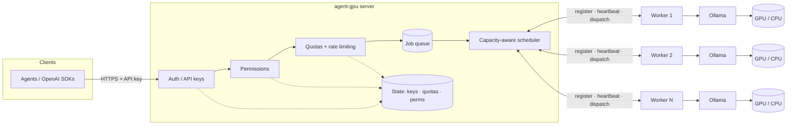
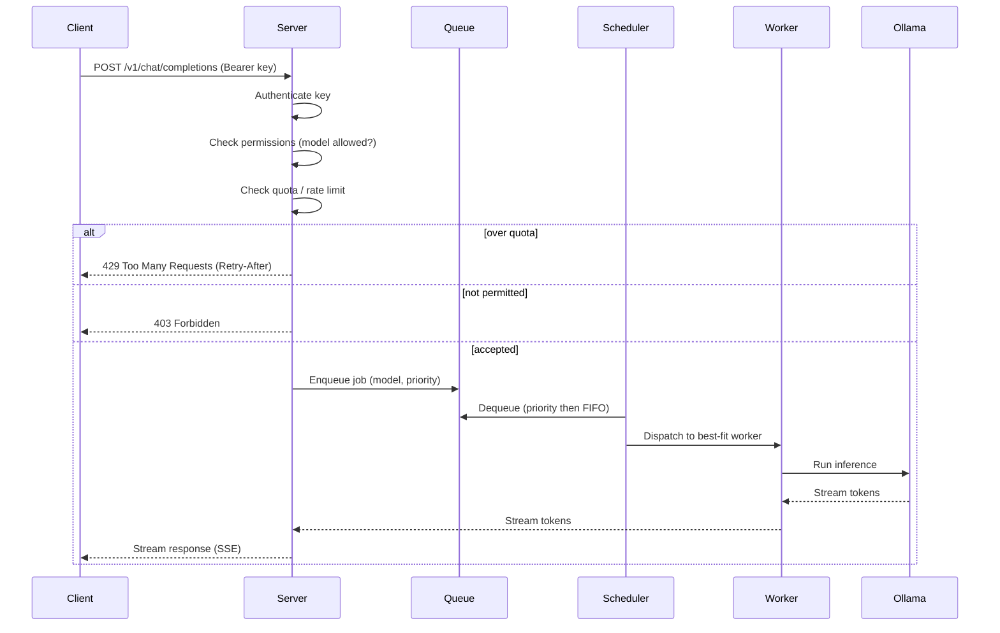

# Architecture

agent-gpu uses a **server + worker** model.

- **Server** — the single entry point. Owns the public API, authenticates API keys, enforces
  permissions and quotas, maintains the job queue, and schedules jobs onto workers.
- **Worker** — runs on any machine with [Ollama](https://ollama.com). Registers with the server,
  reports its capacity via heartbeats, and executes inference jobs against local Ollama.

## System overview



Workers continuously report GPU type, total/free VRAM, current load, active job count, and the
set of models they have available. The scheduler uses these signals — plus the requesting key's
priority — to route each job to a best-fit worker.

## Request flow



## Capacity-aware scheduling

The scheduler (`internal/scheduler`) is the placement core: a **pure, deterministic** function that,
given a fleet snapshot (`Server.Fleet()`) and a target model, picks the best-fit worker. The server
consults it on every dispatch and from the background placement loop. Keeping the math pure (no
clock, no locks, no map-iteration-order dependence) makes the decision reproducible and unit-testable
in isolation from the server's concurrency.

### Runnable candidates

A worker is a candidate for a model only when it is **Online** (never `Draining` or `Stale` — the
liveness state computed in the fleet view) **and** it can plausibly run the model: either it already
has the model loaded **or** it reports free VRAM to load it.

### Scoring weights (highest influence first)

`Score(worker, model)` sums weighted terms, ordered by orders of magnitude so a higher term can never
be outweighed by the sum of every lower term in its expected range:

1. **Model already loaded** — *dominates everything else.* Reusing a loaded model avoids a cold
   load/reload, the single biggest latency win available today.
2. **More free VRAM** — headroom to load and run without thrashing.
3. **Lower load** — the worker's reported 0–100 utilization; prefer the least-busy GPU.
4. **Fewer active jobs** — final tie-break on raw concurrency.

`Pick` filters to runnable candidates, scores each, and returns the highest. **Ties are broken by
worker ID (ascending)** so the choice is stable across calls.

### Fit approximation (no model-size data yet)

There is no per-model VRAM-requirement data yet (real GPU/model-size detection is #16), so "fit" is
approximated as **`FreeVRAM > 0`** (or the model already being loaded). When real footprints land, the
runnability filter and the VRAM term should compare against the model's actual size rather than a
non-zero check.

### API-key priority under contention

Priority is carried by the **queue** (higher priority dequeued first), not by the scoring function.
The per-job priority is derived from the owning key's roles at enqueue time by
`scheduler.PriorityForRoles`, the single centralized (interim) mapping until an explicit per-key
priority field exists:

| Roles | Queue priority |
| --- | --- |
| `admin` | `PriorityHigh` |
| `user` | `PriorityNormal` |
| `read-only` / no roles | `PriorityLow` |

(When a key holds several roles, the highest-implied priority wins.) Keyless internal submits default
to `PriorityNormal`.

### Queue-on-miss and re-evaluation

If no worker fits at submit time the job is **queued, never silently dropped**, and the caller blocks
on a server-level waiter keyed by job ID. A background **placement loop** (mirroring the eviction
loop's `Start`/`Close` lifecycle, clock-injected) dequeues the highest-priority job, waits for a
runnable worker, dispatches it, and resolves the same waiter the caller holds — so each queued job is
dispatched **exactly once**. The loop is woken promptly by a coalescing **capacity signal** raised
whenever capacity may have increased (a heartbeat applied, a job completed, a worker registered), with
a bounded periodic re-check as a backstop. A bounded queue at depth rejects further submits with
`queue.ErrQueueFull` (backpressure) rather than blocking; a cancelled caller drops its waiter so
nothing leaks, and shutdown releases any still-blocked callers.

`Server.QueueStats()` exposes queue depth (total + per-priority breakdown) and enqueue/placement
events are logged via structured `slog` (`key_id`, `model`, `priority`, `reason`; never secrets).

### Future work

- **Anti-starvation / aging.** Strict priority can starve low-priority jobs under sustained
  contention; aging a job's effective priority by its queue wait time is the planned mitigation.
- **Real VRAM-fit.** Replace the `FreeVRAM > 0` approximation with a comparison against each model's
  actual VRAM footprint once model-size detection (#16) lands.
- **Metrics export.** Queue depth and per-worker load become Prometheus metrics in #24; today they
  are plain methods (`QueueStats`) and structured logs.

## Job queue

The global job queue (`internal/queue`) is the in-memory holding area the capacity-aware scheduler
draws from. It is a standalone, concurrency-safe data structure — it owns ordering and backpressure;
it does **not** choose which worker runs a job (that is the scheduler's job) and is not wired into
the dispatch path here.

- **Priority then FIFO.** Three named levels — `PriorityLow` (0), `PriorityNormal` (1, the default),
  `PriorityHigh` (2) — where **higher value is served first**. Within a single level, jobs are served
  strictly first-in-first-out. FIFO-within-level is guaranteed by a monotonic per-queue sequence
  number stamped at enqueue time, so equal-priority jobs always leave in the order they arrived
  regardless of goroutine scheduling. The backing store is a binary heap ordered by
  *(priority descending, sequence ascending)*.
- **Backpressure.** A queue may be bounded with `WithMaxDepth(n)` (`n <= 0` means unbounded). When a
  bounded queue is full, `Enqueue` does **not** block the caller — it returns `ErrQueueFull`
  immediately, the typed seam the request path maps to an explicit 503/429 rather than stalling.
- **Blocking dequeue.** `Dequeue` is non-blocking and reports whether an item was available.
  `DequeueWait(ctx)` blocks (on a condition variable) until an item is available, the context is done
  (returns `ctx.Err()`), or the queue is closed (returns `ErrClosed`) — the seam the scheduler loop
  parks on.
- **Observable depth.** `Len()` returns the total pending count and `Stats()` returns the total plus
  a per-priority breakdown. (Prometheus export is #24; the queue exposes plain methods, not a metrics
  hook.)
- **Concurrency.** All state is guarded by a single mutex paired with a condition variable, so
  enqueue and dequeue are fully atomic: under concurrency no job is lost and none is dequeued twice.
  `Close()` wakes every blocked waiter and is idempotent.

The queue is in-memory only and starts empty on every restart; persistence is out of scope.

## Worker lifecycle / heartbeats

Each worker holds one long-lived bidirectional stream to the server and moves through a small
lifecycle the server tracks in its in-memory fleet view (`Server.Fleet()`):

1. **Registration.** The worker's first message is a `Register` (worker id + advertised models). The
   server acknowledges with a `RegisterAck` carrying a session id and adds the worker to the
   registry as **online**.
2. **Heartbeats.** The worker sends a `Heartbeat` every `heartbeat interval` (default **15s**,
   configurable via `--heartbeat-interval` / `AGENTGPU_HEARTBEAT_INTERVAL`). Each heartbeat reports
   liveness plus capacity signals: GPU type, total/free VRAM, a coarse load value (0–100), the
   current active-job count, and the models the worker has available. The server folds these into
   the worker's fleet entry and stamps its last-seen time. (Real GPU detection arrives with a later
   epic; until then capacity fields are configured/stub values.)
3. **Stale eviction.** A background loop on the server marks a worker **stale** and evicts it once it
   has gone longer than the `heartbeat timeout` without a heartbeat (default **45s** — three missed
   intervals — configurable via `--heartbeat-timeout` / `AGENTGPU_HEARTBEAT_TIMEOUT`). Eviction
   removes the worker from the registry, stops routing to it, and fails any of its in-flight jobs
   with a `worker_stale` error so callers are not left hanging. The loop re-checks roughly every
   `timeout / 2`.
4. **Graceful drain / deregister.** On graceful shutdown a worker sends a `Deregister` before
   closing its stream; an operator can also drain a worker out-of-band (admin seam). A draining
   worker is **skipped by the router for new jobs** but its already-dispatched, in-flight jobs are
   allowed to finish; it is removed once its stream closes.

The router only ever selects workers that are neither draining nor stale. Selecting *which* healthy
worker should run a job (the capacity-aware scoring above) is a separate concern; until it lands the
router picks any healthy worker.

The lifecycle states are summarized below:

```text
online   -> stale     (missed heartbeats past the timeout; evicted, pending jobs fail)
online   -> draining  (Deregister or admin drain; no new jobs, in-flight jobs finish)
draining -> removed   (stream closes after in-flight jobs drain)
stale    -> removed   (evicted by the background loop)
```

## Ollama integration

Each worker runs inference against a **local Ollama instance** it reaches over Ollama's REST API
(default `http://localhost:11434`, configurable via `--ollama-url` / `AGENTGPU_OLLAMA_URL`). The
integration lives in two layers: `internal/ollama` is a thin stdlib-`net/http` client for Ollama;
`worker.OllamaExecutor` adapts it to the worker's `Executor` interface. The echo executor remains the
default test stub and implements the same interface.

### Backend detection and model listing

On startup the worker probes `GET /api/version`. If Ollama answers, the worker logs the version and
seeds its model cache from `GET /api/tags`. If Ollama is **unreachable**, the worker logs a clear
warning and continues **degraded** — it still registers and heartbeats (advertising whatever models
it last knew, possibly none) rather than crashing, so the fleet sees the worker and it recovers once
Ollama comes back. The worker refreshes the model cache before each heartbeat, so the server's fleet
view reflects models being pulled or removed without re-registration. The `--models` flag is a
fallback/override that seeds the advertisement until `/api/tags` is reachable.

### Streaming inference (worker → server)

Inference output is carried as a **true token stream**, not a single final result. The worker runs
`POST /api/chat` with `stream: true`, decodes the NDJSON response line-by-line, and emits one
`JobChunk{delta}` per produced token over the control stream, followed by a terminal
`JobChunk{done=true, tokens=N}` (or `{done=true, error=...}` on failure). The token count is Ollama's
`eval_count + prompt_eval_count` from the terminal object, not a guess.

The server **accumulates** chunks per `job_id` into a per-job buffer and, on the terminal chunk,
resolves the existing pending waiter with the final `JobResult` (accumulated output + tokens, or the
error). `SubmitJob` therefore stays **synchronous** — it still returns one final result — while the
wire carries an incremental stream. A failed inference always produces a terminal error chunk, so a
waiter is resolved exactly once and never hangs. (The client-facing SSE forwarding of these chunks is
the OpenAI-API epic, #13; carrying a real stream now is why that hop is incremental rather than a
single result.)

```text
Ollama NDJSON     worker emits            server accumulates        SubmitJob caller
--------------    --------------------    ----------------------    -------------------
{content:"po"} -> JobChunk{delta:"po"} -> buf["job"]="po"
{content:"ng"} -> JobChunk{delta:"ng"} -> buf["job"]="pong"
{done,eval=3}  -> JobChunk{done,tok=5} -> resolve(JobResult{...}) -> returns "pong", 5 tokens
```

### Permission-gated pull

A model is fetched onto a worker via `Server.PullModel(ctx, key, workerID, model)`. It mirrors the
dispatch path's authorize-before-act ordering: it calls `authz.Authorize(key, model, authz.Pull)`
first, and a denied key returns `authz.ErrForbidden` with **no** `PullModel` message sent — so an
unauthorized caller never reaches Ollama's `/api/pull`. A permitted pull sends a fire-and-forget
`PullModel` control message; the worker drives `POST /api/pull` (draining its NDJSON progress stream)
and advertises the new model on its next heartbeat. Auto-pull on a dispatch miss is intentionally a
**seam**, not built here.

### Error contract

Ollama failures map onto `types.JobError` with stable, machine-readable codes the request path (#13)
can translate to HTTP statuses:

```text
model_not_found     model is not present on the worker (404, or "not found" in the body/stream)
ollama_unreachable  the Ollama server could not be contacted (connection refused, DNS, etc.)
ollama_error        a generic Ollama-reported failure with no more specific code
timeout             the context deadline was exceeded or the job was cancelled mid-stream
invalid_request     Ollama rejected the request as malformed (400)
```

Long inference is bounded by the **caller's context**, not a short global HTTP timeout, so a slow
generation is not spuriously killed; cancelling the context aborts the in-flight HTTP request and
stops emitting.

## Permissions

Authentication (who you are, `internal/auth`) and authorization (what you may do,
`internal/authz`) are deliberately separate. Once a request is authenticated, the authorizer
decides whether the key may perform an **action** — `pull`, `load`, or `infer` — against a named
model, mapping a refusal to `ErrForbidden` (the future HTTP 403, mirroring
`ErrUnauthenticated` → 401).

Each API key carries built-in **roles** plus per-key **allow** and **deny** model lists. Three
roles ship today:

| role        | pull | load | infer | scope                                            |
| ----------- | ---- | ---- | ----- | ------------------------------------------------ |
| `admin`     | yes  | yes  | yes   | all models (ignores allow/deny lists)            |
| `user`      | yes  | yes  | yes   | only models on the key's allow-list              |
| `read-only` | no   | no   | yes   | only models on the key's allow-list              |

Access is **deny-by-default**: a key with no role and no allow-list can do nothing. Every decision
is evaluated against a fixed, deny-wins **precedence order**, returning at the first rule that
fires:

1. model in the key's **deny-list** → **DENY**
2. role `admin` → **ALLOW** (any model, any action)
3. role forbids the action (e.g. `read-only` attempting pull/load) → **DENY**
4. model in the key's **allow-list** (and a granting role is held) → **ALLOW**
5. otherwise → **DENY**

Every decision — granted or denied — is written to the structured audit log with the key id, model,
operation, reason, and (where relevant) role. Denials log at `warn`, grants at `info`. Secrets,
tokens, and hashes are never logged; only the opaque key id.

Permissions are read fresh from the store on every check, so role and list changes take effect
immediately without a restart. Until the admin HTTP endpoints land, roles and lists are managed
with the `agentgpu key create` and `agentgpu key perms` CLI commands.

## Quotas

After a request is authenticated and authorized, the quota engine (`internal/quota`) enforces
per-key **consumption limits**. A request that exceeds a limit is refused with `ErrQuotaExceeded`
— the typed seam the request path maps to HTTP **429** (mirroring `ErrUnauthenticated` → 401 and
`ErrForbidden` → 403). On the dispatch path the order is:

```text
authenticate → authorize → quota.CheckAndReserve → dispatch → quota.RecordTokens
```

`CheckAndReserve` runs **before** dispatch (a refused request never reaches a worker) and reserves
one request against the key's RPM; `RecordTokens` runs **after** the job returns and records the
tokens it actually produced. A request therefore always consumes one RPM unit (the attempt), but
only consumes token budget if the job produced tokens — a failed/zero-token job spends no token
budget.

### Limits

Four dimensions are enforced, each independently:

| dimension       | window | `0` means    |
| --------------- | ------ | ------------ |
| `RPM`           | minute | unlimited    |
| `TPM`           | minute | unlimited    |
| `DailyTokens`   | day    | unlimited    |
| `MonthlyTokens` | month  | unlimited    |

A zero value for any dimension means **unlimited** for that dimension. Limits attach to the key
(`store.APIKey.Limits`): a `nil` override means "use the global defaults" (`--default-rpm`,
`--default-tpm`, … / `QuotaConfig`); a non-nil value overrides the defaults wholesale. Limits are
read fresh from the store on every request, so changes take effect without a restart. They are
managed with `agentgpu key quota set <id> [--rpm …] [--tpm …] [--daily-tokens …]
[--monthly-tokens …] [--clear]`, and inspected with `agentgpu key quota <id>`.

### Reset windows

Windows are **fixed/calendar windows aligned to UTC boundaries**, not continuously sliding: when
the clock crosses a boundary the allowance fully resets. The boundaries are:

- **minute** — the start of the UTC minute (RPM, TPM)
- **day** — UTC midnight, `00:00:00 UTC` (daily token budget)
- **month** — the 1st of the month at `00:00:00 UTC` (monthly token budget)

Token counts come from `JobResult.Tokens`, reported by the worker. The stub echo executor reports
the number of whitespace-separated tokens in its output so accounting is testable today; real
counts arrive with the Ollama integration.

### Persistence

Per-key **limits** change rarely and are persisted with the key in the JSON key store. Per-request
**counters** live in an in-memory, concurrency-safe `CounterStore` (a single mutex serializes
check-and-increment so counts stay exact under concurrency). To survive restarts without per-request
disk writes, the server **checkpoints** the counters to a JSON file (`--quota-path` /
`AGENTGPU_QUOTA_PATH`, default `~/.agentgpu/quota.json`) periodically and on graceful shutdown, and
loads the checkpoint on startup — rolling any windows that expired while the process was down. The
interface is shaped so a Redis-backed counter store (atomic `INCR` per window key) can slot in later
without touching the engine.

## State

Authentication, permission rules, and quota counters are persisted so they survive restarts.
The Docker Compose environment backs this with Redis/Postgres; standalone deployments may use an
embedded store. See the relevant milestones on the roadmap for specifics.

## Technology choices

### Language & runtime: Go

The whole project is a single Go module (`github.com/jaypetez/agent-gpu`) and ships as one binary
with `server` and `worker` subcommands.

- **I/O-bound gateway.** The server is a fan-out/fan-in proxy in front of GPU workers — its work is
  concurrent connections and streaming, not CPU. Go's goroutines and channels model "one stream per
  worker, many in flight" directly, without an async runtime or callback soup.
- **Single-binary, trivial cross-compile.** Operators run agent-gpu on Windows/macOS/Linux across
  x64 and ARM64. Go cross-compiles to all of those from one host with no runtime to install. We
  **avoid cgo** so `GOOS`/`GOARCH` cross-builds stay a one-liner and binaries stay static.
- **Typed contracts end to end.** The server↔worker protocol is defined once in protobuf and
  generated into Go, so both sides share the exact same types.

### Server↔worker transport: gRPC bidirectional streaming

The internal control plane between the server and each worker is **gRPC**, defined in the versioned
protobuf package [`agentgpu.v1`](../proto/agentgpu/v1/agentgpu.proto). Each worker opens **one
persistent bidirectional stream** (`ControlPlane.Connect`) that carries the full lifecycle:

```text
worker → server : Register → Heartbeat* → JobResult*
server → worker : RegisterAck → Job*
```

- **One long-lived stream, both directions.** Registration, heartbeats, job dispatch, and results
  all flow over the same connection — no per-job dials, no inbound port on the worker. Workers can
  sit behind NAT and still receive dispatched jobs because they initiated the stream.
- **Built-in keepalive + client-side reconnect.** gRPC keepalive detects dead links; the worker
  reconnects with **exponential backoff and full jitter**, so a transient drop is invisible to the
  control plane (the server simply re-registers the worker on the new stream).
- **Token streaming maps cleanly.** Streaming inference tokens from worker to server is a natural
  fit for a server-streaming response and is built on this same contract by a later epic.
- **Versioned, append-only contract.** The package is `agentgpu.v1`; every later epic extends these
  messages rather than breaking them. `buf` lints and (later) breaking-change-checks the schema.

> The **public client API stays HTTP and OpenAI-compatible** — gRPC is used only on the internal
> server↔worker hop, not by end users. The HTTP API is built in a separate epic.

### Proto code generation

Stubs under `proto/agentgpu/v1/*.pb.go` are generated and **committed**. Regenerate with
`make proto` (which runs `buf lint` + `buf generate`). Pinned tool versions:

| Tool                 | Version  |
| -------------------- | -------- |
| `buf`                | v1.50.0  |
| `protoc-gen-go`      | v1.36.6  |
| `protoc-gen-go-grpc` | v1.5.1   |

Install them with `make tools`.

<!-- ci: ruleset + admin-merge verification -->
