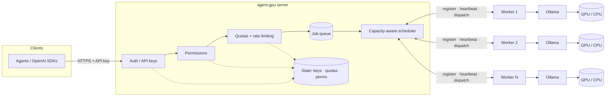
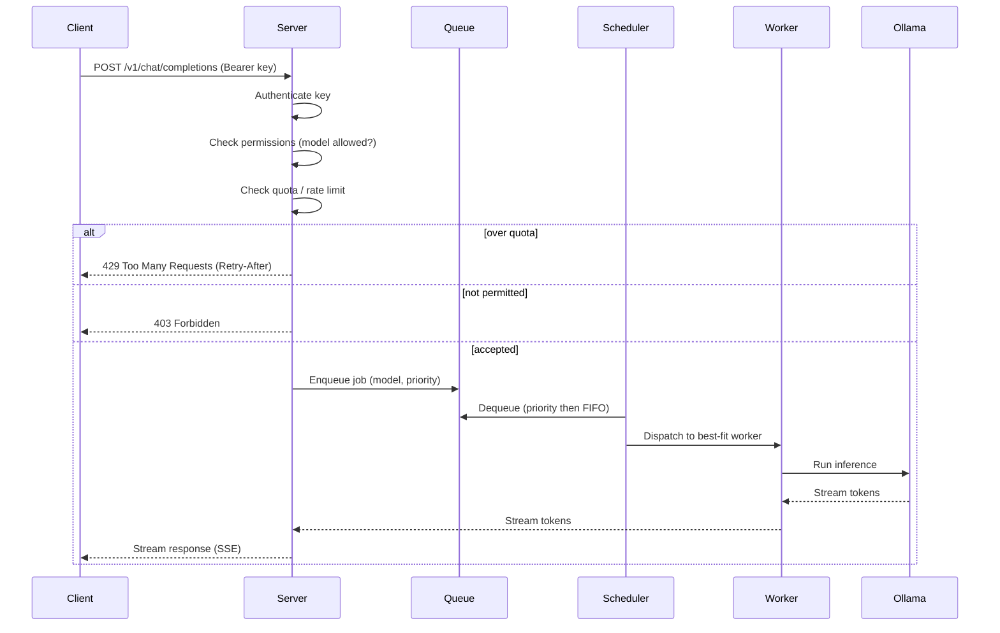

# Architecture

agent-gpu uses a **server + worker** model.

- **Server** — the single entry point. Owns the public API, authenticates API keys, enforces
  permissions and quotas, maintains the job queue, and schedules jobs onto workers.
- **Worker** — runs on any machine with [Ollama](https://ollama.com). Registers with the server,
  reports its capacity via heartbeats, and executes inference jobs against local Ollama.

## System overview



Workers continuously report GPU type, total/free VRAM, current load, active job count, and the
set of models they have available. The scheduler uses these signals — plus the requesting key's
priority — to route each job to a best-fit worker.

## Request flow



## Capacity-aware scheduling

For each job the scheduler scores candidate workers by:

1. **Model availability** — prefer workers that already have the model loaded.
2. **Free VRAM** — the model must fit; larger models go only where they fit.
3. **Current load / active jobs** — spread work and avoid hotspots.
4. **API-key priority** — higher-priority keys win under contention.

If no worker currently fits, the job is **queued** (never silently dropped) and re-evaluated as
capacity frees up. Queue depth and per-worker load are exported as metrics.

## Permissions

Authentication (who you are, `internal/auth`) and authorization (what you may do,
`internal/authz`) are deliberately separate. Once a request is authenticated, the authorizer
decides whether the key may perform an **action** — `pull`, `load`, or `infer` — against a named
model, mapping a refusal to `ErrForbidden` (the future HTTP 403, mirroring
`ErrUnauthenticated` → 401).

Each API key carries built-in **roles** plus per-key **allow** and **deny** model lists. Three
roles ship today:

| role        | pull | load | infer | scope                                            |
| ----------- | ---- | ---- | ----- | ------------------------------------------------ |
| `admin`     | yes  | yes  | yes   | all models (ignores allow/deny lists)            |
| `user`      | yes  | yes  | yes   | only models on the key's allow-list              |
| `read-only` | no   | no   | yes   | only models on the key's allow-list              |

Access is **deny-by-default**: a key with no role and no allow-list can do nothing. Every decision
is evaluated against a fixed, deny-wins **precedence order**, returning at the first rule that
fires:

1. model in the key's **deny-list** → **DENY**
2. role `admin` → **ALLOW** (any model, any action)
3. role forbids the action (e.g. `read-only` attempting pull/load) → **DENY**
4. model in the key's **allow-list** (and a granting role is held) → **ALLOW**
5. otherwise → **DENY**

Every decision — granted or denied — is written to the structured audit log with the key id, model,
operation, reason, and (where relevant) role. Denials log at `warn`, grants at `info`. Secrets,
tokens, and hashes are never logged; only the opaque key id.

Permissions are read fresh from the store on every check, so role and list changes take effect
immediately without a restart. Until the admin HTTP endpoints land, roles and lists are managed
with the `agentgpu key create` and `agentgpu key perms` CLI commands.

## State

Authentication, permission rules, and quota counters are persisted so they survive restarts.
The Docker Compose environment backs this with Redis/Postgres; standalone deployments may use an
embedded store. See the relevant milestones on the roadmap for specifics.

## Technology choices

### Language & runtime: Go

The whole project is a single Go module (`github.com/jaypetez/agent-gpu`) and ships as one binary
with `server` and `worker` subcommands.

- **I/O-bound gateway.** The server is a fan-out/fan-in proxy in front of GPU workers — its work is
  concurrent connections and streaming, not CPU. Go's goroutines and channels model "one stream per
  worker, many in flight" directly, without an async runtime or callback soup.
- **Single-binary, trivial cross-compile.** Operators run agent-gpu on Windows/macOS/Linux across
  x64 and ARM64. Go cross-compiles to all of those from one host with no runtime to install. We
  **avoid cgo** so `GOOS`/`GOARCH` cross-builds stay a one-liner and binaries stay static.
- **Typed contracts end to end.** The server↔worker protocol is defined once in protobuf and
  generated into Go, so both sides share the exact same types.

### Server↔worker transport: gRPC bidirectional streaming

The internal control plane between the server and each worker is **gRPC**, defined in the versioned
protobuf package [`agentgpu.v1`](../proto/agentgpu/v1/agentgpu.proto). Each worker opens **one
persistent bidirectional stream** (`ControlPlane.Connect`) that carries the full lifecycle:

```text
worker → server : Register → Heartbeat* → JobResult*
server → worker : RegisterAck → Job*
```

- **One long-lived stream, both directions.** Registration, heartbeats, job dispatch, and results
  all flow over the same connection — no per-job dials, no inbound port on the worker. Workers can
  sit behind NAT and still receive dispatched jobs because they initiated the stream.
- **Built-in keepalive + client-side reconnect.** gRPC keepalive detects dead links; the worker
  reconnects with **exponential backoff and full jitter**, so a transient drop is invisible to the
  control plane (the server simply re-registers the worker on the new stream).
- **Token streaming maps cleanly.** Streaming inference tokens from worker to server is a natural
  fit for a server-streaming response and is built on this same contract by a later epic.
- **Versioned, append-only contract.** The package is `agentgpu.v1`; every later epic extends these
  messages rather than breaking them. `buf` lints and (later) breaking-change-checks the schema.

> The **public client API stays HTTP and OpenAI-compatible** — gRPC is used only on the internal
> server↔worker hop, not by end users. The HTTP API is built in a separate epic.

### Proto code generation

Stubs under `proto/agentgpu/v1/*.pb.go` are generated and **committed**. Regenerate with
`make proto` (which runs `buf lint` + `buf generate`). Pinned tool versions:

| Tool                 | Version  |
| -------------------- | -------- |
| `buf`                | v1.50.0  |
| `protoc-gen-go`      | v1.36.6  |
| `protoc-gen-go-grpc` | v1.5.1   |

Install them with `make tools`.

<!-- ci: ruleset + admin-merge verification -->
